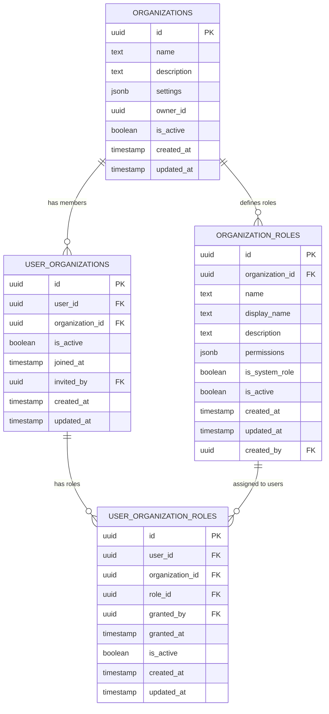
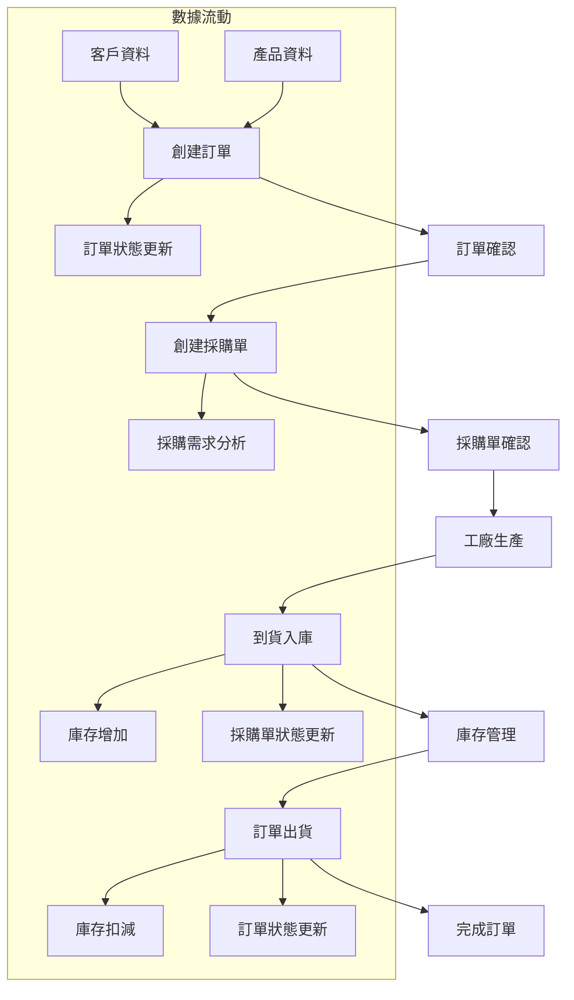
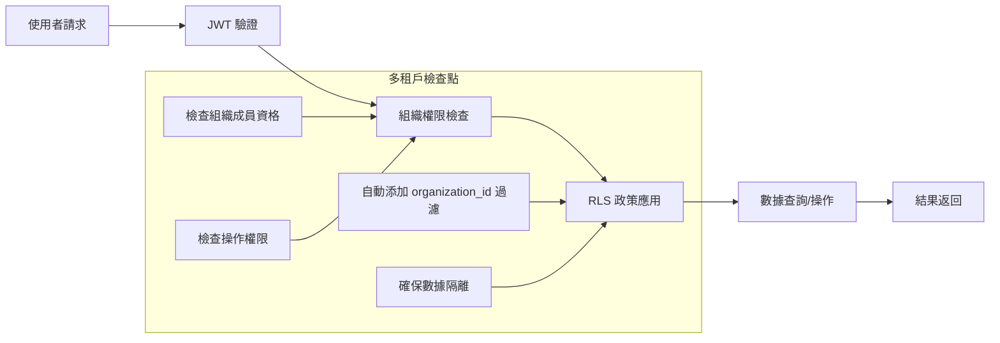

# 數據映射文檔

## 1. 概述

本文檔基於 DTDD (Document-driven Test-driven Development) 方法論，詳細描述紡織業多租戶組織 ERP 系統的數據結構、關係映射和業務流程中的數據流動。系統採用多租戶架構，所有業務數據都與組織相關聯，確保數據隔離和安全性。

## 2. 多租戶數據架構

### 2.1 組織數據隔離模型



### 2.2 業務數據組織關聯

```sql
-- 所有業務表格都包含 organization_id 欄位
ALTER TABLE products_new ADD COLUMN organization_id UUID REFERENCES organizations(id);
ALTER TABLE customers ADD COLUMN organization_id UUID REFERENCES organizations(id);
ALTER TABLE factories ADD COLUMN organization_id UUID REFERENCES organizations(id);
ALTER TABLE orders ADD COLUMN organization_id UUID REFERENCES organizations(id);
ALTER TABLE purchase_orders ADD COLUMN organization_id UUID REFERENCES organizations(id);
ALTER TABLE inventories ADD COLUMN organization_id UUID REFERENCES organizations(id);
ALTER TABLE shippings ADD COLUMN organization_id UUID REFERENCES organizations(id);
ALTER TABLE warehouses ADD COLUMN organization_id UUID REFERENCES organizations(id);
```

## 3. 核心實體數據映射

### 3.1 產品管理數據映射

```typescript
// 產品實體映射
interface ProductDataMapping {
  // 基本資訊
  id: string;                    // 產品唯一識別碼
  organization_id: string;       // 組織 ID (多租戶)
  name: string;                  // 產品名稱
  category: string;              // 產品分類
  color?: string;                // 顏色名稱
  color_code?: string;           // 顏色代碼
  unit_of_measure: string;       // 計量單位
  status: ProductStatus;         // 產品狀態
  stock_thresholds?: number;     // 庫存閾值
  
  // 追蹤資訊
  user_id: string;               // 創建者 ID
  updated_by?: string;           // 最後更新者 ID
  created_at: Date;              // 創建時間
  updated_at: Date;              // 更新時間
}

// 產品狀態枚舉
enum ProductStatus {
  Available = 'Available',       // 可用
  Discontinued = 'Discontinued', // 停產
  OutOfStock = 'OutOfStock'      // 缺貨
}
```

### 3.2 客戶管理數據映射

```typescript
// 客戶實體映射
interface CustomerDataMapping {
  id: string;                    // 客戶唯一識別碼
  organization_id: string;       // 組織 ID (多租戶)
  name: string;                  // 客戶名稱
  address?: string;              // 客戶地址
  phone?: string;                // 聯絡電話
  email?: string;                // 電子郵件
  contact_person?: string;       // 聯絡人
  created_at: Date;              // 創建時間
  updated_at: Date;              // 更新時間
}

// 客戶訂單關係映射
interface CustomerOrderRelation {
  customer_id: string;           // 客戶 ID
  orders: OrderSummary[];        // 訂單摘要列表
  total_order_value: number;     // 總訂單金額
  order_count: number;           // 訂單數量
  last_order_date?: Date;        // 最後訂單日期
}
```

### 3.3 訂單管理數據映射

```typescript
// 訂單主檔映射
interface OrderDataMapping {
  id: string;                    // 訂單唯一識別碼
  organization_id: string;       // 組織 ID (多租戶)
  order_number: string;          // 訂單編號
  customer_id: string;           // 客戶 ID
  status: OrderStatus;           // 訂單狀態
  shipping_status: ShippingStatus; // 出貨狀態
  payment_status: PaymentStatus; // 付款狀態
  note?: string;                 // 備註
  user_id: string;               // 創建者 ID
  created_at: Date;              // 創建時間
  updated_at: Date;              // 更新時間
}

// 訂單產品明細映射
interface OrderProductDataMapping {
  id: string;                    // 明細唯一識別碼
  order_id: string;              // 訂單 ID
  product_id: string;            // 產品 ID
  quantity: number;              // 訂購數量
  shipped_quantity: number;      // 已出貨數量
  unit_price: number;            // 單價
  total_rolls?: number;          // 總卷數
  specifications?: object;       // 規格要求
  status: string;                // 明細狀態 (pending, partial_shipped, shipped)
  created_at: Date;              // 創建時間
  updated_at: Date;              // 更新時間
}

// 訂單狀態枚舉
enum OrderStatus {
  Pending = 'pending',           // 待確認
  Confirmed = 'confirmed',       // 已確認
  InProduction = 'in_production', // 生產中
  Completed = 'completed',       // 已完成
  Cancelled = 'cancelled'        // 已取消
}

enum ShippingStatus {
  NotStarted = 'not_started',    // 未開始
  PartialShipped = 'partial_shipped', // 部分出貨
  Shipped = 'shipped'            // 已出貨
}

enum PaymentStatus {
  Unpaid = 'unpaid',             // 未付款
  PartialPaid = 'partial_paid',  // 部分付款
  Paid = 'paid'                  // 已付款
}
```

### 3.4 庫存管理數據映射

```typescript
// 庫存主檔映射
interface InventoryDataMapping {
  id: string;                    // 庫存唯一識別碼
  organization_id: string;       // 組織 ID (多租戶)
  purchase_order_id: string;     // 採購單 ID
  factory_id: string;            // 工廠 ID
  arrival_date: Date;            // 到貨日期
  user_id: string;               // 入庫操作者 ID
  note?: string;                 // 備註
  created_at: Date;              // 創建時間
  updated_at: Date;              // 更新時間
}

// 庫存布卷明細映射
interface InventoryRollDataMapping {
  id: string;                    // 布卷唯一識別碼
  inventory_id: string;          // 庫存 ID
  product_id: string;            // 產品 ID
  warehouse_id: string;          // 倉庫 ID
  roll_number: string;           // 布卷編號
  shelf?: string;                // 貨架位置
  quantity: number;              // 數量
  current_quantity: number;      // 當前數量
  quality: FabricQuality;        // 品質等級
  specifications?: object;       // 規格資訊
  is_allocated: boolean;         // 是否已分配
  created_at: Date;              // 創建時間
  updated_at: Date;              // 更新時間
}

// 品質等級枚舉
enum FabricQuality {
  A = 'A',                       // A級品
  B = 'B',                       // B級品
  C = 'C',                       // C級品
  D = 'D',                       // D級品
  Defective = 'defective'        // 次品
}

// 庫存摘要視圖映射
interface InventorySummaryMapping {
  product_id: string;            // 產品 ID
  product_name: string;          // 產品名稱
  color: string;                 // 顏色
  color_code: string;            // 顏色代碼
  total_stock: number;           // 總庫存
  total_rolls: number;           // 總卷數
  a_grade_stock: number;         // A級品庫存
  b_grade_stock: number;         // B級品庫存
  c_grade_stock: number;         // C級品庫存
  d_grade_stock: number;         // D級品庫存
  defective_stock: number;       // 次品庫存
  stock_thresholds: number;      // 庫存閾值
  product_status: ProductStatus; // 產品狀態
  pending_in_quantity: number;   // 待入庫數量
  pending_out_quantity: number;  // 待出庫數量
}
```

### 3.5 出貨管理數據映射

```typescript
// 出貨主檔映射
interface ShippingDataMapping {
  id: string;                    // 出貨唯一識別碼
  organization_id: string;       // 組織 ID (多租戶)
  shipping_number: string;       // 出貨單號
  order_id: string;              // 訂單 ID
  customer_id: string;           // 客戶 ID
  shipping_date: Date;           // 出貨日期
  total_shipped_quantity: number; // 總出貨數量
  total_shipped_rolls: number;   // 總出貨卷數
  user_id: string;               // 出貨操作者 ID
  note?: string;                 // 備註
  created_at: Date;              // 創建時間
  updated_at: Date;              // 更新時間
}

// 出貨明細映射
interface ShippingItemDataMapping {
  id: string;                    // 出貨明細唯一識別碼
  shipping_id: string;           // 出貨 ID
  inventory_roll_id: string;     // 庫存布卷 ID
  shipped_quantity: number;      // 出貨數量
  created_at: Date;              // 創建時間
  updated_at: Date;              // 更新時間
}
```

## 4. 權限數據映射

### 4.1 組織權限結構映射

```typescript
// 組織角色權限映射
interface OrganizationRolePermissionMapping {
  role_id: string;               // 角色 ID
  role_name: string;             // 角色名稱
  display_name: string;          // 顯示名稱
  permissions: {
    // 產品管理權限
    canViewProducts: boolean;
    canCreateProducts: boolean;
    canEditProducts: boolean;
    canDeleteProducts: boolean;
    
    // 庫存管理權限
    canViewInventory: boolean;
    canCreateInventory: boolean;
    canEditInventory: boolean;
    
    // 訂單管理權限
    canViewOrders: boolean;
    canCreateOrders: boolean;
    canEditOrders: boolean;
    
    // 採購管理權限
    canViewPurchases: boolean;
    canCreatePurchases: boolean;
    canEditPurchases: boolean;
    
    // 出貨管理權限
    canViewShipping: boolean;
    canCreateShipping: boolean;
    canEditShipping: boolean;
    
    // 客戶管理權限
    canViewCustomers: boolean;
    canCreateCustomers: boolean;
    canEditCustomers: boolean;
    
    // 工廠管理權限
    canViewFactories: boolean;
    canCreateFactories: boolean;
    canEditFactories: boolean;
    
    // 使用者管理權限
    canViewUsers: boolean;
    canCreateUsers: boolean;
    canEditUsers: boolean;
    
    // 組織管理權限
    canManageOrganization: boolean;
    canManageUsers: boolean;
    canManageRoles: boolean;
    
    // 系統設定權限
    canViewPermissions: boolean;
    canEditPermissions: boolean;
    canViewSystemSettings: boolean;
    canEditSystemSettings: boolean;
  };
}

// 使用者組織權限映射
interface UserOrganizationPermissionMapping {
  user_id: string;               // 使用者 ID
  organization_id: string;       // 組織 ID
  is_owner: boolean;             // 是否為組織擁有者
  roles: {
    role_id: string;             // 角色 ID
    role_name: string;           // 角色名稱
    granted_at: Date;            // 授予時間
    granted_by: string;          // 授予者 ID
  }[];
  aggregated_permissions: Record<string, boolean>; // 聚合權限
}
```

### 4.2 預設角色權限配置

```typescript
// 系統預設角色權限配置
const DEFAULT_ROLE_PERMISSIONS = {
  owner: {
    display_name: '組織擁有者',
    permissions: {
      // 擁有所有權限
      canManageOrganization: true,
      canManageUsers: true,
      canManageRoles: true,
      canViewAll: true,
      canEditAll: true,
      canDeleteAll: true
    }
  },
  
  admin: {
    display_name: '管理員',
    permissions: {
      canViewProducts: true,
      canCreateProducts: true,
      canEditProducts: true,
      canDeleteProducts: true,
      canViewInventory: true,
      canCreateInventory: true,
      canEditInventory: true,
      canViewOrders: true,
      canCreateOrders: true,
      canEditOrders: true,
      canViewPurchases: true,
      canCreatePurchases: true,
      canEditPurchases: true,
      canViewShipping: true,
      canCreateShipping: true,
      canEditShipping: true,
      canViewCustomers: true,
      canCreateCustomers: true,
      canEditCustomers: true,
      canViewFactories: true,
      canCreateFactories: true,
      canEditFactories: true,
      canViewUsers: true,
      canCreateUsers: true,
      canEditUsers: true,
      canViewPermissions: true,
      canEditPermissions: true,
      canViewSystemSettings: true,
      canEditSystemSettings: true
    }
  },
  
  sales: {
    display_name: '業務',
    permissions: {
      canViewProducts: true,
      canViewInventory: true,
      canViewOrders: true,
      canCreateOrders: true,
      canEditOrders: true,
      canViewPurchases: true,
      canViewShipping: true,
      canViewCustomers: true,
      canCreateCustomers: true,
      canEditCustomers: true,
      canViewFactories: true
    }
  },
  
  warehouse: {
    display_name: '倉庫管理員',
    permissions: {
      canViewProducts: true,
      canViewInventory: true,
      canCreateInventory: true,
      canEditInventory: true,
      canViewOrders: true,
      canViewPurchases: true,
      canViewShipping: true,
      canCreateShipping: true,
      canEditShipping: true
    }
  }
};
```

## 5. 業務流程數據流映射

### 5.1 訂單到出貨數據流



### 5.2 組織數據隔離流程



## 6. 數據同步和一致性

### 6.1 訂單狀態同步映射

```sql
-- 訂單產品狀態更新觸發器
CREATE OR REPLACE FUNCTION update_order_product_status()
RETURNS TRIGGER
LANGUAGE PLPGSQL
AS $$
BEGIN
  -- 更新訂單項目已出貨數量
  UPDATE order_products 
  SET shipped_quantity = (
    SELECT COALESCE(SUM(si.shipped_quantity), 0)
    FROM shipping_items si
    INNER JOIN shippings s ON si.shipping_id = s.id
    INNER JOIN inventory_rolls ir ON si.inventory_roll_id = ir.id
    WHERE s.order_id = order_products.order_id
    AND ir.product_id = order_products.product_id
  )
  WHERE order_id = (SELECT order_id FROM shippings WHERE id = NEW.shipping_id);
  
  -- 更新訂單項目狀態
  UPDATE order_products 
  SET status = CASE 
    WHEN shipped_quantity >= quantity THEN 'shipped'
    WHEN shipped_quantity > 0 THEN 'partial_shipped'
    ELSE 'pending'
  END
  WHERE order_id = (SELECT order_id FROM shippings WHERE id = NEW.shipping_id);
  
  RETURN NEW;
END;
$$;
```

### 6.2 庫存數量同步映射

```sql
-- 庫存數量更新函數
CREATE OR REPLACE FUNCTION update_inventory_quantities()
RETURNS TRIGGER
LANGUAGE PLPGSQL
AS $$
BEGIN
  -- 出貨時扣減庫存
  IF TG_OP = 'INSERT' AND TG_TABLE_NAME = 'shipping_items' THEN
    UPDATE inventory_rolls 
    SET current_quantity = current_quantity - NEW.shipped_quantity
    WHERE id = NEW.inventory_roll_id;
  END IF;
  
  -- 入庫時增加庫存
  IF TG_OP = 'INSERT' AND TG_TABLE_NAME = 'inventory_rolls' THEN
    NEW.current_quantity := NEW.quantity;
  END IF;
  
  RETURN COALESCE(NEW, OLD);
END;
$$;
```

## 7. 報表和分析數據映射

### 7.1 庫存分析視圖

```sql
-- 增強庫存摘要視圖
CREATE VIEW inventory_summary_enhanced AS
SELECT 
  p.id as product_id,
  p.name as product_name,
  p.color,
  p.color_code,
  p.status as product_status,
  p.stock_thresholds,
  p.organization_id,
  
  -- 總庫存統計
  COALESCE(SUM(ir.current_quantity), 0) as total_stock,
  COUNT(ir.id) as total_rolls,
  
  -- 按品質分級統計
  COALESCE(SUM(CASE WHEN ir.quality = 'A' THEN ir.current_quantity ELSE 0 END), 0) as a_grade_stock,
  COALESCE(SUM(CASE WHEN ir.quality = 'B' THEN ir.current_quantity ELSE 0 END), 0) as b_grade_stock,
  COALESCE(SUM(CASE WHEN ir.quality = 'C' THEN ir.current_quantity ELSE 0 END), 0) as c_grade_stock,
  COALESCE(SUM(CASE WHEN ir.quality = 'D' THEN ir.current_quantity ELSE 0 END), 0) as d_grade_stock,
  COALESCE(SUM(CASE WHEN ir.quality = 'defective' THEN ir.current_quantity ELSE 0 END), 0) as defective_stock,
  
  -- 卷數統計
  COUNT(CASE WHEN ir.quality = 'A' THEN 1 END) as a_grade_rolls,
  COUNT(CASE WHEN ir.quality = 'B' THEN 1 END) as b_grade_rolls,
  COUNT(CASE WHEN ir.quality = 'C' THEN 1 END) as c_grade_rolls,
  COUNT(CASE WHEN ir.quality = 'D' THEN 1 END) as d_grade_rolls,
  COUNT(CASE WHEN ir.quality = 'defective' THEN 1 END) as defective_rolls,
  
  -- 待處理數量
  COALESCE(pending_in.quantity, 0) as pending_in_quantity,
  COALESCE(pending_out.quantity, 0) as pending_out_quantity
  
FROM products_new p
LEFT JOIN inventory_rolls ir ON p.id = ir.product_id AND ir.current_quantity > 0
LEFT JOIN (
  -- 待入庫數量
  SELECT 
    poi.product_id,
    SUM(poi.ordered_quantity - poi.received_quantity) as quantity
  FROM purchase_order_items poi
  JOIN purchase_orders po ON poi.purchase_order_id = po.id
  WHERE po.status NOT IN ('completed', 'cancelled')
  GROUP BY poi.product_id
) pending_in ON p.id = pending_in.product_id
LEFT JOIN (
  -- 待出貨數量
  SELECT 
    op.product_id,
    SUM(op.quantity - op.shipped_quantity) as quantity
  FROM order_products op
  JOIN orders o ON op.order_id = o.id
  WHERE o.status NOT IN ('completed', 'cancelled')
  GROUP BY op.product_id
) pending_out ON p.id = pending_out.product_id
GROUP BY p.id, p.name, p.color, p.color_code, p.status, p.stock_thresholds, p.organization_id,
         pending_in.quantity, pending_out.quantity;
```

### 7.2 銷售分析數據映射

```typescript
// 銷售報表數據映射
interface SalesAnalyticsMapping {
  organization_id: string;       // 組織 ID
  period: {
    start_date: Date;            // 統計開始日期
    end_date: Date;              // 統計結束日期
  };
  
  summary: {
    total_orders: number;        // 總訂單數
    total_revenue: number;       // 總營收
    total_quantity: number;      // 總銷售數量
    average_order_value: number; // 平均訂單價值
  };
  
  by_customer: {
    customer_id: string;         // 客戶 ID
    customer_name: string;       // 客戶名稱
    order_count: number;         // 訂單數量
    total_value: number;         // 總金額
    total_quantity: number;      // 總數量
  }[];
  
  by_product: {
    product_id: string;          // 產品 ID
    product_name: string;        // 產品名稱
    color: string;               // 顏色
    order_count: number;         // 訂單數量
    total_quantity: number;      // 總銷售數量
    total_value: number;         // 總銷售金額
  }[];
  
  monthly_trend: {
    month: string;               // 月份 (YYYY-MM)
    order_count: number;         // 訂單數量
    revenue: number;             // 營收
    quantity: number;            // 銷售數量
  }[];
}
```

## 8. 數據驗證和約束

### 8.1 業務邏輯約束

```sql
-- 庫存數量不能為負數
ALTER TABLE inventory_rolls 
ADD CONSTRAINT check_current_quantity_non_negative 
CHECK (current_quantity >= 0);

-- 出貨數量不能超過庫存數量
CREATE OR REPLACE FUNCTION validate_shipping_quantity()
RETURNS TRIGGER
LANGUAGE PLPGSQL
AS $$
BEGIN
  IF (SELECT current_quantity FROM inventory_rolls WHERE id = NEW.inventory_roll_id) < NEW.shipped_quantity THEN
    RAISE EXCEPTION '出貨數量不能超過庫存數量';
  END IF;
  RETURN NEW;
END;
$$;

CREATE TRIGGER trigger_validate_shipping_quantity
  BEFORE INSERT OR UPDATE ON shipping_items
  FOR EACH ROW
  EXECUTE FUNCTION validate_shipping_quantity();
```

### 8.2 組織數據隔離約束

```sql
-- 確保跨表格的組織一致性
CREATE OR REPLACE FUNCTION validate_organization_consistency()
RETURNS TRIGGER
LANGUAGE PLPGSQL
AS $$
BEGIN
  -- 檢查訂單和客戶是否屬於同一組織
  IF TG_TABLE_NAME = 'orders' THEN
    IF (SELECT organization_id FROM customers WHERE id = NEW.customer_id) != NEW.organization_id THEN
      RAISE EXCEPTION '訂單客戶必須屬於同一組織';
    END IF;
  END IF;
  
  -- 檢查庫存和產品是否屬於同一組織
  IF TG_TABLE_NAME = 'inventory_rolls' THEN
    IF (SELECT p.organization_id FROM products_new p JOIN inventories i ON i.organization_id = p.organization_id WHERE i.id = NEW.inventory_id) IS NULL THEN
      RAISE EXCEPTION '庫存產品必須屬於同一組織';
    END IF;
  END IF;
  
  RETURN NEW;
END;
$$;
```

## 9. 資料移轉策略

### 9.1 現有資料組織分配

```sql
-- 為現有資料分配到預設組織
DO $$
DECLARE
  default_org_id UUID;
BEGIN
  -- 創建預設組織
  INSERT INTO organizations (name, description, owner_id)
  VALUES ('預設組織', '系統升級時創建的預設組織', (SELECT id FROM auth.users LIMIT 1))
  RETURNING id INTO default_org_id;
  
  -- 將現有資料分配到預設組織
  UPDATE products_new SET organization_id = default_org_id WHERE organization_id IS NULL;
  UPDATE customers SET organization_id = default_org_id WHERE organization_id IS NULL;
  UPDATE factories SET organization_id = default_org_id WHERE organization_id IS NULL;
  UPDATE orders SET organization_id = default_org_id WHERE organization_id IS NULL;
  UPDATE purchase_orders SET organization_id = default_org_id WHERE organization_id IS NULL;
  UPDATE inventories SET organization_id = default_org_id WHERE organization_id IS NULL;
  UPDATE shippings SET organization_id = default_org_id WHERE organization_id IS NULL;
  UPDATE warehouses SET organization_id = default_org_id WHERE organization_id IS NULL;
END $$;
```

### 9.2 使用者組織關聯建立

```sql
-- 將現有使用者加入預設組織
INSERT INTO user_organizations (user_id, organization_id, is_active, joined_at)
SELECT 
  p.id,
  (SELECT id FROM organizations WHERE name = '預設組織'),
  true,
  now()
FROM profiles p
WHERE NOT EXISTS (
  SELECT 1 FROM user_organizations uo WHERE uo.user_id = p.id
);

-- 為現有使用者分配適當角色
INSERT INTO user_organization_roles (user_id, organization_id, role_id, granted_by, granted_at)
SELECT 
  p.id,
  (SELECT id FROM organizations WHERE name = '預設組織'),
  (SELECT id FROM organization_roles WHERE name = 
    CASE 
      WHEN p.role = 'admin' THEN 'admin'
      WHEN p.role = 'sales' THEN 'sales'
      ELSE 'assistant'
    END
    AND organization_id = (SELECT id FROM organizations WHERE name = '預設組織')
  ),
  (SELECT owner_id FROM organizations WHERE name = '預設組織'),
  now()
FROM profiles p;
```

---

**文檔版本**: 2.0  
**最後更新**: 2025-06-17  
**負責人**: 數據架構團隊  
**審查週期**: 每週一次
