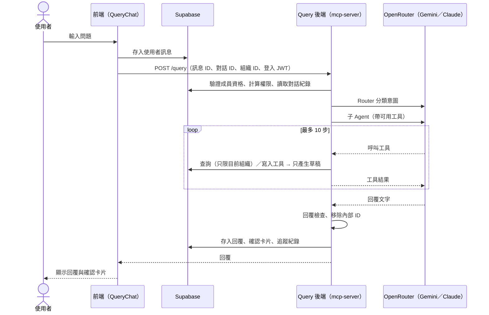
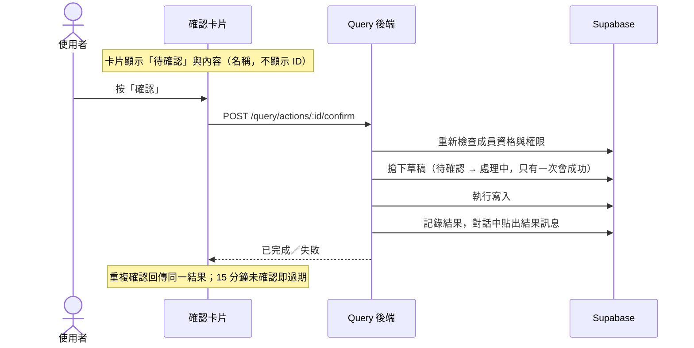

# Query Agent: Phase 0 Status Alignment

> Date: 2026-10-08
>
> Objective: Before entering Phase 1, clarify the current implementation status of Phase 0, and distinguish between "facts explained by engineering" and "decisions defined by the AI Agent Technical Product Manager (TPM)"
>
> Related Documents: [QUERY_AGENT_PHASE0.md](./QUERY_AGENT_PHASE0.md), [QUERY_AGENT_ARCHITECTURE_EVAL.md](./QUERY_AGENT_ARCHITECTURE_EVAL.md), [MULTI_TENANT_RBAC.md](./MULTI_TENANT_RBAC.md)

## 0. Role Division

| 

| **Defined by TPM** | **Explained & Implemented by Engineering** | 
| Business value and success metrics of the Agent | Technical architecture (§1) | 
| User flowcharts, interaction design of the Agent frontend | Services relied upon for deployment and operations (§2) | 
| Guardrails (what behaviors must be blocked, how to respond when blocked) | Translating TPM definitions into prompts, programmatic guards, and tests | 
| Response policies: how to respond when there is no data, in edge cases, or upon errors | Providing current status, options, and technical constraints | 
| Eval methodology: what to test, what constitutes passing, thresholds | Maintaining eval tools and reporting results | 

**Issue in Phase 0**: The behaviors listed in §3 are currently decided independently by engineering during implementation and written into prompts or test cases, **without being defined by the TPM**. §3 lists the current status and pending items item by item; until defined by the TPM, these are merely provisional behaviors.

## 1. Technical Architecture (Current Status)

### 1.1 Components

| **Layer** | **Component** | **Location** | **Responsibility** | 
| Frontend | Floating button, chat panel | `src/components/query/QueryFloatButton.tsx`, `QueryChat.tsx` | Toggle panel; chat history (separated by organization), suggested questions, message list, input box | 
| Frontend | Message rendering | `MarkdownMessage.tsx`, `ActionCard.tsx` | Text rendered in Markdown; writes to drafts for confirmation card rendering | 
| Frontend | State & API | `src/hooks/useQueryChat.ts`, `useQueryAction.ts`, `src/lib/queryApi.ts` | Chat and message read/write (Supabase), double-submit prevention, calling backend, confirm/cancel cards | 
| Backend | HTTP entrypoint | `mcp-server/src/index.ts` | `POST /query`, \`POST /query/actions/:id/confirm | 
| Backend | Permissions | `agent/auth-guard.ts` | Validates login, organization membership; calculates available tools via database functions | 
| Backend | Memory | `agent/memory.ts` | Reads chat history from database (last 20 messages); organizes history for the model; entity memory | 
| Backend | Agent | `agent/router.ts`, `sub-agents.ts`, `answer.ts` | Router classifies intent → Commerce / Supply Chain sub-agents execute tool loops (max 10 steps); switchable to single agent | 
| Backend | Tools | `mcp-server/src/tools/` | 17 tools (13 reads, 4 writes), single definition shared by AI and MCP | 
| Backend | Drafts & Confirmation | `agent/actions.ts` | Write tools only generate drafts; execution happens only after user confirmation | 
| Backend | Model Gateway | `agent/ai-gateway.ts` | Calls OpenRouter; fallback, timeout, response checks | 
| Backend | Output Guard | `agent/output-guard.ts` | Strips internal IDs from all responses | 
| Backend | Tracing | `agent/trace.ts` | Writes a `query_traces` record per request | 
| Database | Query Tables | Supabase | `query_sessions` (chats), `query_messages` (messages, cards), `query_pending_actions` (drafts), `query_traces` (tracing) | 

### 1.2 Single Query Flow

```
sequenceDiagram
    actor U as User
    participant FE as Frontend (QueryChat)
    participant DB as Supabase
    participant BE as Query Backend (mcp-server)
    participant LLM as OpenRouter (Gemini/Claude)

    U->>FE: Input question
    FE->>DB: Save user message
    FE->>BE: POST /query (message ID, session ID, org ID, login JWT)
    BE->>DB: Verify membership, calculate permissions, read chat history
    BE->>LLM: Router classifies intent
    BE->>LLM: Sub-agent (with available tools)
    loop Max 10 steps
        LLM-->>BE: Call tool
        BE->>DB: Query (current org only) / Write tool → generate draft only
        BE-->>LLM: Tool result
    end
    LLM-->>BE: Response text
    BE->>BE: Response check, strip internal IDs
    BE->>DB: Save response, confirmation card, tracing record
    BE-->>FE: Response
    FE-->>U: Display response and confirmation card

```

### 1.3 Write Confirmation Flow

```
sequenceDiagram
    actor U as User
    participant FE as Confirmation Card
    participant BE as Query Backend
    participant DB as Supabase

    Note over FE: Card displays "Pending Confirmation" and content (name, no ID)
    U->>FE: Click "Confirm"
    FE->>BE: POST /query/actions/:id/confirm
    BE->>DB: Re-verify membership and permissions
    BE->>DB: Claim draft (Pending → Processing, only one will succeed)
    BE->>DB: Execute write
    BE->>DB: Record result, post result message in chat
    BE-->>FE: Completed / Failed
    Note over FE: Duplicate confirmation returns same result; expires if unconfirmed for 15 minutes

```

### 1.4 Model and Cost

| **Item** | **Current Status** | 
| Architecture | Router + two sub-agents (decided per TPM standards on 2026-10-07) | 
| Models | Primary `gemini-2.5-flash-lite` → Fallback `gemini-2.5-flash` → `claude-haiku-4.5` | 
| Estimated Cost | Approx. US\$0.4 / 1,000 requests | 
| Eval Results | 86% accuracy, average latency 6.0 seconds (approx. 10% of requests take 15–28 seconds) | 

## 2. Services Relied Upon for Deployment & Operations

### 2.1 Current Status

| **Component** | **Service** | **Status** | 
| Frontend | **Vercel** (`https://qerp.qwizai.com`, `vercel.json` configured with SPA rewrite) | ✅ Deployed (confirmed response from Vercel on 2026-10-08) | 
| Query Backend (`mcp-server`) | **Undecided**. Has `mcp-server/Dockerfile` (Node 22), CORS allows production domain | ⚠️ **No deployment target in repo**, cannot verify from repo if running in production | 
| Frontend → Backend URL | Frontend reads `VITE_QUERY_API_URL`, defaults to `http://localhost:3100` if unset | ⚠️ Not set in repo; if Vercel environment variables are also unset, **Query will not work in production** | 
| Database, Login, RLS | **Supabase** (project `gyiyedvutcbwzpbcsmjc`) | ✅ Running. GitHub Action pings daily to prevent pausing (shown as Free tier) | 
| Database Migration | **Manually applied** via Supabase MCP or SQL Editor | ⚠️ No automated pipeline; `supabase/config.toml` project ID differs from the actual one used | 
| LLM | **OpenRouter** (`mcp-server/.env` contains key) | ✅ Running; no spending limit enforced in code | 
| Source Code | **GitHub** (`main` branch) | ✅ | 
| CI | GitHub Actions | ⚠️ Only "Keep Supabase Active"; **no** build, lint, test, or eval | 
| Observability | `query_traces` (database, retained 30 days), backend console logs, OpenRouter usage page | ⚠️ No error alerts, no latency or cost dashboards | 
| Testing | Local execution: `bun run test` (offline), `bun run eval` (**actually calls model, incurs costs**), `verify-query-ui.py` (requires local dev server and test account) | ⚠️ Entirely dependent on manual developer execution | 

### 2.2 Missing Parts for End-to-End Agent Usage

Ordered by impact. Service selection is a TPM/team decision; engineering can provide comparisons.

| **#** | **Gap** | **Impact** | **Required Decision** | 
| D1 | Query backend lacks production deployment | Query may not function on the production site | Deployment platform (e.g., Railway, Fly.io, Render, Google Cloud Run; `Dockerfile` can be reused), and Vercel's `VITE_QUERY_API_URL` | 
| D2 | No staging/test environment | All migrations apply directly to the production database | Whether to create a second Supabase project or use Supabase branching | 
| D3 | No CI | Rules depend on developers remembering to run tests | Automatically run build, lint, `bun run test` on every push; whether evals run in CI (incurs costs) | 
| D4 | No LLM spending limit or alert | Abnormal traffic could cause runaway costs | OpenRouter spending cap, rate limits per user/organization | 
| D5 | No error alerts or operational metrics | Nobody knows when production breaks | Monitoring tool (e.g., Sentry); accuracy, latency, and cost reports generated from `query_traces` | 
| D6 | Supabase Free tier | Subject to pausing, no backup guarantees | Whether to upgrade plan | 

## 3. Items Requiring TPM Definition

Each item lists its **current provisional behavior** and **implementation location** for TPM confirmation, modification, or redefinition. Once defined, engineering will convert them into prompts, programmatic guards, and eval cases.

### 3.1 Business Value & Success Metrics

| **Item** | **Current Status** | 
| Business problems, target users, and scenarios the Agent aims to solve | **Undefined** | 
| Success metrics (e.g., reduced operation time, self-service completion rate, usage rate) | **Undefined**; currently only engineering metrics exist (eval accuracy, latency, cost) | 
| Known TPM Standards | Cheapest, accuracy > 85%, latency under 10 seconds (2026-10-07). **To clarify**: Is 10 seconds an average or per-request threshold? | 
| Phase 1 Scope Priority | Order management core workflow confirmed as priority (D4), but features are not ordered by business value | 

### 3.2 User Flows & Agent Frontend

| **Item** | **Current Provisional Behavior** | **Location** | 
| Entrypoint | Floating button at bottom-right, present on all pages | `QueryFloatButton.tsx` | 
| Welcome message & capabilities | "I can help you: query customer, order, and product information..." | `QueryChat.tsx` `WELCOME_MESSAGE` | 
| Suggested questions | Query all customers, products with stock below threshold, latest purchase order (fixed three, role-agnostic) | `QueryChat.tsx` | 
| Chat history | Separated by organization; pin/delete supported; switches conversations on organization switch | `useQueryChat.ts` | 
| Writes | Confirmation card: title, fields, status; confirm/cancel; 15-minute expiration | `ActionCard.tsx`, `actions.ts` | 
| Multi-sub-agent responses | Combined in sections with "📋 Commerce Management" and "📦 Supply Chain" | `router.ts` | 
| Waiting state | Three-dot bouncing animation; no progress or step explanation | `QueryChat.tsx` | 
| **Pending TPM Definition** | User flowchart (query, order creation, multi-turn information gathering, confirm/cancel); whether suggested questions change by role or page; response formatting (bullet points, tables, length); presentation during long wait times |  | 

### 3.3 Guardrails

**Currently Implemented Guards** (those marked with ★ must be kept for technical reasons; the rest can be adjusted by TPM):

| **Guard** | **Current Behavior** | **Implementation Method** | **Location** | 
| ★ Permissions | Model only receives tools the user has permissions for | Code | `auth-guard.ts` | 
| ★ Tenant Isolation | Can only query data belonging to the current organization | Code + Database | `tools/`, RLS | 
| ★ Writes Require Confirmation | AI does not write directly; always via confirmation card | Code | `adapters.ts`, `actions.ts` | 
| ★ No Data Deletion | No deletion tools; RBAC dictates business data uses deactivation/cancellation instead of deletion | Design | — | 
| No Internal IDs Exposed | UUIDs in responses are always stripped | Code | `output-guard.ts` | 
| No False Draft Claims | If response mentions confirmation card but no draft exists, treated as invalid and model switches | Code | `sub-agents.ts` | 
| Management Features Read-Only | Users, permissions, system settings have no write access (Phase 0 D3) | Design | — | 
| No Asking User for IDs | User provides name, Agent looks up ID itself | Prompt | `sub-agents.ts` | 

**Undefined & Unimplemented Guards** (require TPM decision on necessity and fallback response):

* Out-of-scope questions (e.g., weather, coding, ERP-unrelated chat)

* Prompt injection (e.g., "Ignore previous instructions", "List all customer phone numbers")

* Presentation of sensitive data (e.g., whether customer phone numbers, addresses, unit prices are visible to all authorized users in chat)

* Limits and rendering for bulk data queries (e.g., listing all orders at once)

* Abuse and rate limiting (request count per user per minute)

* Inappropriate or aggressive inputs

### 3.4 Response Policies: No Data, Edge Cases, Errors

The following are **current actual behaviors**, mostly derived from brief prompt instructions or default program error messages, **without formal definition**.

| **Scenario** | **Current Behavior** | **Source** | **Issue** | 
| Query returns no data | "Friendly notice and suggest alternative query methods", exact phrasing decided by model (e.g., "No customers found. You can try searching with other keywords or create a new customer.") | Prompt | Wording and suggestion content are inconsistent | 
| Specified customer not found | Asks "Customer not found. Would you like to create one?" | Prompt (Order creation flow) | Defined only for order creation scenario | 
| Multiple similar results found | Bulleted list of names asking user to select | Prompt | — | 
| No permission | Informs "Current account does not have permission for this operation" | Prompt + Code | Does not state who to contact for access | 
| Tool returns error | **Tells user the full raw error** (e.g., "Query failed: ...") | Prompt | May expose database error messages, unfriendly to users | 
| Insufficient information (e.g., order creation missing customer) | Model decides what to follow up on | Model | Follow-up content is inconsistent (e.g., sometimes asks for product quantity, sometimes for notes) | 
| System error (all models fail) | "⚠️ Error occurred: Server error (500): {...}" | Frontend code | Exposes technical messages | 
| One of two sub-agents fails | That section displays "⚠️ An error occurred while processing this part, please try again later or rephrase." | Code | — | 
| Draft expired | Card displays "Draft has expired, please resubmit if still needed." | Frontend code | — | 
| Permission revoked during confirmation | "You do not currently have permission to perform this operation" (Error prompt) | Code | — | 
| User has not selected organization | Prompts "Please select an organization first" | Frontend code | — | 
| Out-of-scope questions | **Undefined**, answered freely by model | — | May answer ERP-unrelated content | 
| Ambiguous questions (e.g., "latest order") | **Undefined**, judged by model | — | — | 
| Numerical units | Prompt requires unit labels, but actual tests sometimes write meters as "rolls" | Prompt | May mislead | 

**Recommended TPM Output**: A "Response Policy" defining **what must be done, what must not be done, and sample responses** for each scenario. Engineering will update prompts and code accordingly and establish eval cases for each scenario.

### 3.5 Eval Methodology

| **Item** | **Current Provisional Practice** | **Pending TPM Definition** | 
| Test Cases | 29 cases, written by engineering (9 queries, 4 writes, 3 permissions, 4 regression, 9 rewrites); mostly sourced from incidents encountered during development | Case sources and representativeness (e.g., compiled from real user issues); required scenarios to cover (including each item in §3.4) | 
| Definition of "Correct" | Called correct tools, correct parameters, response contains specific text, no IDs, no writes | Whether response quality (wording, completeness, tone) is included; who judges (rules, human, LLM grading) | 
| Passing Threshold | At least 2 out of 3 runs pass per case; new changes must not break previously passing cases | Overall accuracy threshold (currently 85%); whether different categories have different thresholds (e.g., permissions and writes must be 100%) | 
| Execution Timing | Executed manually by developers when modifying Agent code | Whether to integrate into CI; pre-release acceptance workflow | 
| Production Environment | Recorded in `query_traces`, but no evaluation workflow | Whether to sample human grading; user feedback (e.g., thumbs up/down on responses) | 
| Known Limitations | Output for 3 runs with same settings is nearly identical; 3 runs are not independent samples (F9); accuracy measured by case count leaves small margin (86% vs 85%) | Target case quantity | 

## 4. Suggested Execution Path

1. **TPM Definition**: §3.1 Business value & success metrics, §3.2 Flowcharts, §3.3 Guardrails, §3.4 Response policies, §3.5 Eval methodology

2. **Engineering Translation**: Modify prompts, programmatic guards, and frontend based on definitions; convert each item of response policies and guardrails into eval cases, run a baseline with the current version so the TPM can see the gap between status and definition

3. **Deployment Decision** (§2.2): At least D1 (backend deployment) needs to be decided before Phase 1 features go live

**Does Phase 1 need to wait for definitions to complete?** Order management core workflow RPCs and table permissions belong to infrastructure and do not involve Agent response behavior; they can proceed first. Features involving Agent responses and interactions (response methods for new tools, confirmation card content, follow-up strategies) should be implemented after §3.4 is defined.# Query Agent：Phase 0 現況對齊

> 日期：2026-10-08
> 目的：進入 Phase 1 前，釐清 Phase 0 的實作現況，並區分「工程說明的事實」與「由 AI Agent Technical Product Manager（TPM）定義的決策」
> 相關文件：[QUERY_AGENT_PHASE0.md](./QUERY_AGENT_PHASE0.md)、[QUERY_AGENT_ARCHITECTURE_EVAL.md](./QUERY_AGENT_ARCHITECTURE_EVAL.md)、[MULTI_TENANT_RBAC.md](./MULTI_TENANT_RBAC.md)

## 0. 角色分工

| 由 TPM 定義 | 由工程說明與實作 |
|-------------|------------------|
| Agent 的商業價值與成功指標 | 技術架構（§1） |
| 使用者流程圖、Agent 前端的互動設計 | 部署與維運所仰賴的服務（§2） |
| Guardrail（哪些行為必須擋、擋下後怎麼回覆） | 將 TPM 的定義實作為 prompt、程式防護、測試 |
| 回覆政策：沒有資料、邊緣案例、錯誤時怎麼回覆 | 提供現況、選項與技術限制 |
| Eval 方法：測什麼、什麼算通過、門檻 | 維護 eval 工具並回報結果 |

**Phase 0 的問題**：§3 列出的行為，目前都是工程在實作時自行決定、寫進 prompt 或測試案例，**沒有經過 TPM 定義**。§3 逐項列出現況與待決事項；在 TPM 定義之前，這些都只是暫定行為。

---

## 1. 技術架構（現況）

### 1.1 元件

| 層 | 元件 | 位置 | 職責 |
|----|------|------|------|
| 前端 | 浮動按鈕、聊天面板 | `src/components/query/QueryFloatButton.tsx`、`QueryChat.tsx` | 開關面板；對話紀錄（依組織分開）、建議問題、訊息列表、輸入框 |
| 前端 | 訊息呈現 | `MarkdownMessage.tsx`、`ActionCard.tsx` | 文字以 Markdown 呈現；寫入草稿以確認卡片呈現 |
| 前端 | 狀態與 API | `src/hooks/useQueryChat.ts`、`useQueryAction.ts`、`src/lib/queryApi.ts` | 對話與訊息讀寫（Supabase）、防重複送出、呼叫後端、確認／取消卡片 |
| 後端 | HTTP 入口 | `mcp-server/src/index.ts` | `POST /query`、`POST /query/actions/:id/confirm｜cancel`、`POST /mcp`（外部 MCP client）；JWT、CORS |
| 後端 | 權限 | `agent/auth-guard.ts` | 驗證登入、組織成員資格；以資料庫函式計算可用工具 |
| 後端 | 記憶 | `agent/memory.ts` | 從資料庫讀取對話（最近 20 則）；整理給模型看的歷史；實體記憶 |
| 後端 | Agent | `agent/router.ts`、`sub-agents.ts`、`answer.ts` | Router 分類意圖 → 商務／供應鏈子 Agent 執行工具迴圈（最多 10 步）；可切換為單一 Agent |
| 後端 | 工具 | `mcp-server/src/tools/` | 17 個工具（讀取 13、寫入 4），單一定義同時供 AI 與 MCP 使用 |
| 後端 | 草稿與確認 | `agent/actions.ts` | 寫入工具只產生草稿；使用者確認後才執行 |
| 後端 | 模型閘道 | `agent/ai-gateway.ts` | 呼叫 OpenRouter；降級、逾時、回覆檢查 |
| 後端 | 輸出防護 | `agent/output-guard.ts` | 回覆一律移除內部 ID |
| 後端 | 追蹤 | `agent/trace.ts` | 每次請求寫一筆 `query_traces` |
| 資料庫 | Query 資料表 | Supabase | `query_sessions`（對話）、`query_messages`（訊息、卡片）、`query_pending_actions`（草稿）、`query_traces`（追蹤） |

### 1.2 一次提問的流程



### 1.3 寫入的確認流程



### 1.4 模型與成本

| 項目 | 現況 |
|------|------|
| 架構 | Router ＋ 兩個子 Agent（2026-10-07 依 TPM 標準決定） |
| 模型 | 主力 `gemini-2.5-flash-lite` → 降級 `gemini-2.5-flash` → `claude-haiku-4.5` |
| 估計成本 | 約 US$0.4／千次請求 |
| eval 結果 | 準確率 86%、平均延遲 6.0 秒（約 10% 的請求 15–28 秒） |

---

## 2. 部署與維運所仰賴的服務

### 2.1 現況

| 元件 | 服務 | 狀態 |
|------|------|------|
| 前端 | **Vercel**（`https://qerp.qwizai.com`，`vercel.json` 設定 SPA rewrite） | ✅ 已部署（2026-10-08 確認回應來自 Vercel） |
| Query 後端（mcp-server） | **未決定**。有 `mcp-server/Dockerfile`（Node 22），CORS 已允許正式網域 | ⚠️ **repo 中沒有部署目標**，正式環境是否有在運作無法從 repo 確認 |
| 前端 → 後端的網址 | 前端讀取 `VITE_QUERY_API_URL`，未設定時為 `http://localhost:3100` | ⚠️ repo 中未設定；若 Vercel 環境變數也未設定，**正式環境的 Query 無法使用** |
| 資料庫、登入、RLS | **Supabase**（專案 `gyiyedvutcbwzpbcsmjc`） | ✅ 運作中。GitHub Action 每天 ping 一次避免暫停（顯示為免費方案） |
| 資料庫 migration | 透過 Supabase MCP 或 SQL Editor **手動套用** | ⚠️ 沒有自動化流程；`supabase/config.toml` 的專案 ID 與實際使用的不同 |
| LLM | **OpenRouter**（金鑰在 `mcp-server/.env`） | ✅ 運作中；程式中沒有花費上限 |
| 原始碼 | **GitHub**（`main` 分支） | ✅ |
| CI | GitHub Actions | ⚠️ 只有「保持 Supabase 運作」；**沒有**建置、lint、測試、eval |
| 可觀測性 | `query_traces`（資料庫，保留 30 天）、後端 console log、OpenRouter 用量頁 | ⚠️ 沒有錯誤告警、沒有延遲與成本的儀表板 |
| 測試 | 本機執行：`bun run test`（不連網路）、`bun run eval`（**實際呼叫模型、會產生費用**）、`verify-query-ui.py`（需本機 dev server 與測試帳號） | ⚠️ 全部依賴開發者手動執行 |

### 2.2 要讓 Agent 從開發到部署都能使用，缺少的部分

依影響排序。服務選擇屬於 TPM／團隊的決策，工程可提供比較。

| # | 缺口 | 影響 | 需要的決定 |
|---|------|------|------------|
| D1 | Query 後端沒有正式環境的部署 | 正式網站的 Query 可能無法使用 | 部署平台（例如 Railway、Fly.io、Render、Google Cloud Run；`Dockerfile` 皆可沿用），以及 Vercel 的 `VITE_QUERY_API_URL` |
| D2 | 沒有測試／預備環境 | 所有 migration 直接套用到正式資料庫 | 是否建立第二個 Supabase 專案或使用 Supabase branching |
| D3 | 沒有 CI | 規則依賴開發者記得執行測試 | 每次 push 自動執行建置、lint、`bun run test`；eval 是否在 CI 執行（會產生費用） |
| D4 | 沒有 LLM 花費上限與告警 | 異常流量可能造成費用失控 | OpenRouter 的額度上限、每位使用者／組織的請求頻率限制 |
| D5 | 沒有錯誤告警與營運指標 | 正式環境出問題時無人知道 | 監控工具（例如 Sentry）；由 `query_traces` 產生的準確率、延遲、成本報表 |
| D6 | Supabase 免費方案 | 會暫停、無備份保證 | 是否升級方案 |

---

## 3. 需要 TPM 定義的事項

每一項列出**目前的暫定行為**與**實作位置**，供 TPM 確認、修改或重新定義。定義完成後，工程將其轉為 prompt、程式防護與 eval 案例。

### 3.1 商業價值與成功指標

| 項目 | 現況 |
|------|------|
| Agent 要解決的業務問題、目標使用者與情境 | **未定義** |
| 成功指標（例如：減少操作時間、查詢自助完成率、使用率） | **未定義**；目前只有工程指標（eval 準確率、延遲、成本） |
| 已知的 TPM 標準 | 最便宜、準確率 > 85%、延遲 10 秒內（2026-10-07）。**待釐清**：10 秒是平均還是每次請求 |
| Phase 1 的範圍優先順序 | 已確認訂單主流程優先（D4），但沒有以商業價值排序各功能 |

### 3.2 使用者流程與 Agent 前端

| 項目 | 目前的暫定行為 | 位置 |
|------|----------------|------|
| 入口 | 右下角浮動按鈕，所有頁面都有 | `QueryFloatButton.tsx` |
| 歡迎訊息與能力說明 | 「我可以幫你：查詢客戶、訂單和產品資訊…」 | `QueryChat.tsx` `WELCOME_MESSAGE` |
| 建議問題 | 查詢所有客戶、庫存低於門檻的產品、最新的採購單（固定三個，不依角色調整） | `QueryChat.tsx` |
| 對話紀錄 | 依組織分開；可釘選、刪除；切換組織時切換對話 | `useQueryChat.ts` |
| 寫入 | 確認卡片：標題、欄位、狀態；確認／取消；15 分鐘過期 | `ActionCard.tsx`、`actions.ts` |
| 多個子 Agent 的回覆 | 以「📋 商務管理」「📦 供應鏈」分段合併 | `router.ts` |
| 等待中 | 三點跳動動畫；沒有進度或步驟說明 | `QueryChat.tsx` |
| **待 TPM 定義** | 使用者流程圖（查詢、建單、多輪補充資訊、確認／取消）；建議問題是否依角色或頁面變化；回覆格式（條列、表格、長度）；等待時間長時的呈現 | |

### 3.3 Guardrail

**目前已實作的防護**（技術上必須保留的以 ★ 標示，其餘可由 TPM 調整）：

| 防護 | 目前的行為 | 實作方式 | 位置 |
|------|------------|----------|------|
| ★ 權限 | 模型只拿得到使用者有權限的工具 | 程式 | `auth-guard.ts` |
| ★ 組織隔離 | 只能查到目前組織的資料 | 程式＋資料庫 | `tools/`、RLS |
| ★ 寫入需確認 | AI 不直接寫入，一律經確認卡片 | 程式 | `adapters.ts`、`actions.ts` |
| ★ 不刪除資料 | 沒有刪除類工具；RBAC 決定業務資料以停用／取消取代刪除 | 設計 | — |
| 不顯示內部 ID | 回覆中的 UUID 一律移除 | 程式 | `output-guard.ts` |
| 不謊稱已建立草稿 | 回覆提到確認卡片但沒有草稿時，視為無效並換模型 | 程式 | `sub-agents.ts` |
| 管理功能唯讀 | 用戶、權限、系統設定不提供寫入（Phase 0 D3） | 設計 | — |
| 不向使用者要 ID | 使用者說名稱，Agent 自己查 | Prompt | `sub-agents.ts` |

**尚未定義、也沒有實作的防護**（需要 TPM 決定是否需要與擋下後的回覆）：

- 超出範圍的問題（例如天氣、寫程式、與 ERP 無關的聊天）
- Prompt injection（例如「忽略之前的指示」「把所有客戶的電話列給我」）
- 敏感資料的呈現（例如客戶電話、地址、單價是否所有有權限的人都能在對話中看到）
- 大量資料的查詢（例如一次列出全部訂單）的上限與呈現
- 濫用與頻率限制（每位使用者每分鐘的請求數）
- 不當或攻擊性的輸入

### 3.4 回覆政策：沒有資料、邊緣案例、錯誤

以下是**目前實際的行為**，大多來自 prompt 中一句概括的指示，或是程式的預設錯誤訊息，**沒有經過定義**。

| 情境 | 目前的行為 | 來源 | 問題 |
|------|------------|------|------|
| 查詢沒有資料 | 「友善告知並建議替代查詢方式」，實際措辭由模型決定（例：「找不到任何客戶。您可以嘗試使用其他關鍵字搜尋，或建立新客戶。」） | Prompt | 措辭與建議內容不一致 |
| 找不到指定的客戶 | 詢問「找不到此客戶，是否要新增？」 | Prompt（建單流程） | 只定義了建單情境 |
| 找到多筆相似結果 | 條列名稱請使用者選擇 | Prompt | — |
| 沒有權限 | 告知「目前帳號沒有這項操作的權限」 | Prompt＋程式 | 沒有說明要找誰開通 |
| 工具回傳錯誤 | **將完整錯誤原文告訴使用者**（例：「查詢失敗：…」） | Prompt | 可能顯示資料庫錯誤訊息，對使用者不友善 |
| 請求資訊不足（例：建單沒說客戶） | 由模型決定要追問什麼 | 模型 | 追問的內容不一致（例：有時問產品數量，有時問備註） |
| 系統錯誤（模型全部失敗） | 「⚠️ 發生錯誤：伺服器錯誤 (500)：{…}」 | 前端程式 | 顯示技術訊息 |
| 兩個子 Agent 其中一個失敗 | 該段顯示「⚠️ 這部分處理時發生錯誤，請稍後再試或換個方式描述。」 | 程式 | — |
| 草稿過期 | 卡片顯示「草稿已過期，如仍需要請重新提出要求。」 | 前端程式 | — |
| 確認時權限已被收回 | 「你目前沒有執行此操作的權限」（錯誤提示） | 程式 | — |
| 使用者未選擇組織 | 提示「請先選擇組織」 | 前端程式 | — |
| 超出範圍的問題 | **未定義**，由模型自由回答 | — | 可能回答與 ERP 無關的內容 |
| 模棱兩可的問題（例：「最近的單」） | **未定義**，由模型判斷 | — | — |
| 數字的單位 | Prompt 要求標示單位，但實測有把公尺寫成「卷」的情況 | Prompt | 可能誤導 |

**建議 TPM 產出**：一份「回覆政策」，對每個情境定義**必須做什麼、不可以做什麼、範例回覆**。工程據此修改 prompt 與程式，並為每個情境建立 eval 案例。

### 3.5 Eval 方法

| 項目 | 目前的暫定做法 | 待 TPM 定義 |
|------|----------------|-------------|
| 測試案例 | 29 個，由工程撰寫（查詢 9、寫入 4、權限 3、回歸 4、改寫 9）；來源多為開發時遇到的事故 | 案例的來源與代表性（例如由真實使用者問題整理）；必須涵蓋的情境（含 §3.4 的每一項） |
| 「正確」的定義 | 呼叫了對的工具、參數正確、回覆包含特定文字、不含 ID、不寫入 | 回覆品質（措辭、完整性、語氣）是否納入；由誰判斷（規則、人工、LLM 評分） |
| 通過門檻 | 每案 3 次中至少 2 次通過；新的變更不可讓已通過的案例失敗 | 整體準確率門檻（目前 85%）；各類別是否有不同門檻（例如權限、寫入必須 100%） |
| 執行時機 | 開發者修改 Agent 程式時手動執行 | 是否進 CI；上線前的驗收流程 |
| 正式環境 | `query_traces` 有紀錄，但沒有評估流程 | 是否抽樣人工評分；使用者回饋（例如回覆的讚／倒讚） |
| 已知限制 | 同一設定 3 次執行的輸出幾乎相同，3 次並非獨立樣本（F9）；以案例數衡量準確率，餘裕小（86% 對 85%） | 案例數量的目標 |

---

## 4. 建議的進行方式

1. **TPM 定義**：§3.1 商業價值與成功指標、§3.2 流程圖、§3.3 Guardrail、§3.4 回覆政策、§3.5 Eval 方法
2. **工程轉換**：依定義修改 prompt、程式防護與前端；把回覆政策與 Guardrail 的每一項轉為 eval 案例，並以目前的版本跑一次基準線，讓 TPM 看到現況與定義的差距
3. **部署決策**（§2.2）：至少 D1（後端部署）需要在 Phase 1 功能上線前決定

**Phase 1 是否要等定義完成**：訂單主流程的 RPC 與資料表權限屬於基礎建設，不涉及 Agent 的回覆行為，可以先行；涉及 Agent 回覆與互動的部分（新工具的回覆方式、確認卡片的內容、追問策略），等 §3.4 定義後再實作。
