# 紡織業 ERP 系統序列圖文檔

## 概述

本文檔包含紡織業 ERP 系統所有核心功能的序列圖，按照 PRD 中定義的功能模組進行組織。每個序列圖詳細描述了系統各組件之間的交互流程。

## 1. 使用者認證流程

### 1.1 使用者登入
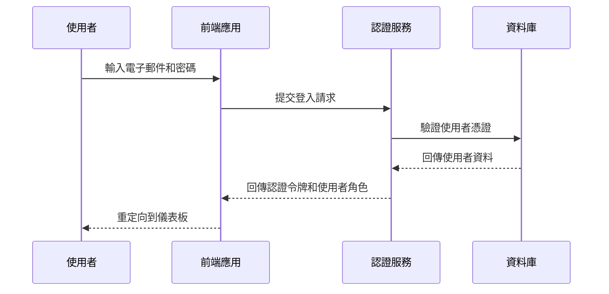
```mermaid
sequenceDiagram
    participant User as 使用者
    participant Frontend as 前端應用
    participant Auth as 認證服務
    participant DB as 資料庫

    User->>Frontend: 輸入電子郵件和密碼
    Frontend->>Auth: 提交登入請求
    Auth->>DB: 驗證使用者憑證
    DB-->>Auth: 回傳使用者資料
    Auth-->>Frontend: 回傳認證令牌和使用者角色
    Frontend-->>User: 重定向到儀表板
```

### 1.2 角色權限驗證
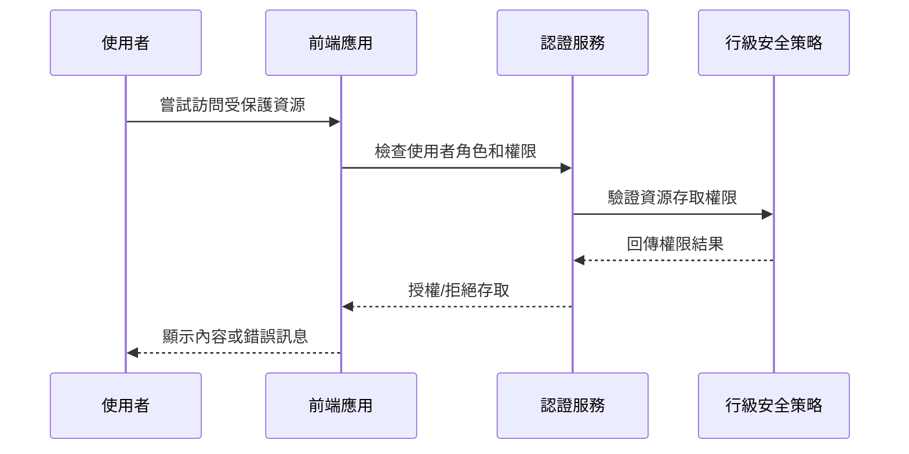
```mermaid
sequenceDiagram
    participant User as 使用者
    participant Frontend as 前端應用
    participant Auth as 認證服務
    participant RLS as 行級安全策略

    User->>Frontend: 嘗試訪問受保護資源
    Frontend->>Auth: 檢查使用者角色和權限
    Auth->>RLS: 驗證資源存取權限
    RLS-->>Auth: 回傳權限結果
    Auth-->>Frontend: 授權/拒絕存取
    Frontend-->>User: 顯示內容或錯誤訊息
```

## 2. 產品管理流程

### 2.1 新增產品
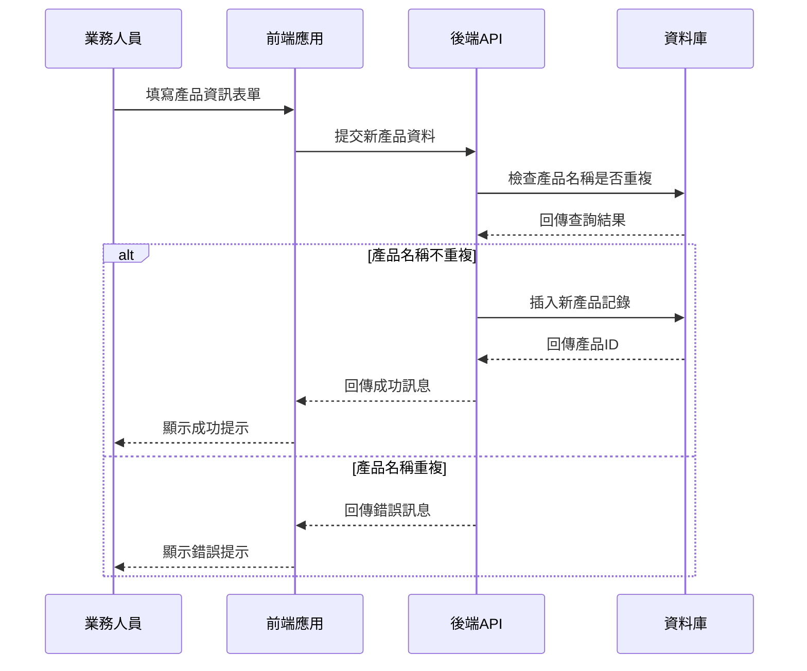
```mermaid
sequenceDiagram
    participant Sales as 業務人員
    participant Frontend as 前端應用
    participant API as 後端API
    participant DB as 資料庫

    Sales->>Frontend: 填寫產品資訊表單
    Frontend->>API: 提交新產品資料
    API->>DB: 檢查產品名稱是否重複
    DB-->>API: 回傳查詢結果
    alt 產品名稱不重複
        API->>DB: 插入新產品記錄
        DB-->>API: 回傳產品ID
        API-->>Frontend: 回傳成功訊息
        Frontend-->>Sales: 顯示成功提示
    else 產品名稱重複
        API-->>Frontend: 回傳錯誤訊息
        Frontend-->>Sales: 顯示錯誤提示
    end
```

### 2.2 編輯產品資訊
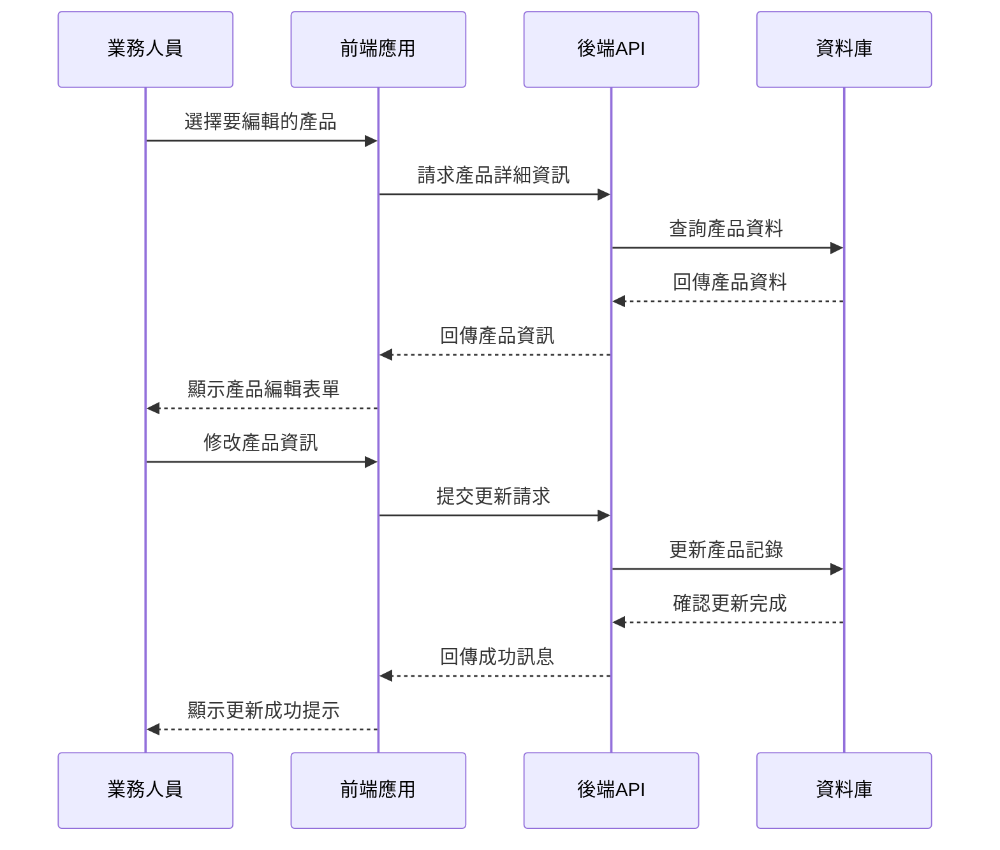
```mermaid
sequenceDiagram
    participant Sales as 業務人員
    participant Frontend as 前端應用
    participant API as 後端API
    participant DB as 資料庫

    Sales->>Frontend: 選擇要編輯的產品
    Frontend->>API: 請求產品詳細資訊
    API->>DB: 查詢產品資料
    DB-->>API: 回傳產品資料
    API-->>Frontend: 回傳產品資訊
    Frontend-->>Sales: 顯示產品編輯表單
    Sales->>Frontend: 修改產品資訊
    Frontend->>API: 提交更新請求
    API->>DB: 更新產品記錄
    DB-->>API: 確認更新完成
    API-->>Frontend: 回傳成功訊息
    Frontend-->>Sales: 顯示更新成功提示
```

## 3. 客戶與供應商管理流程

### 3.1 新增客戶
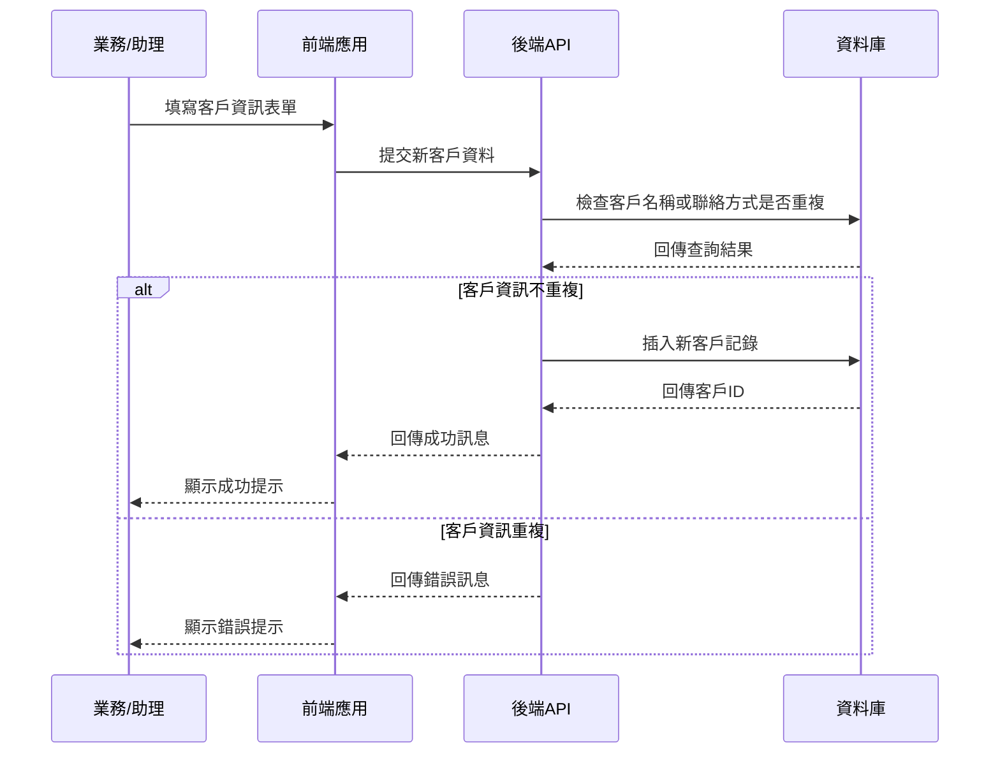
```mermaid
sequenceDiagram
    participant User as 業務/助理
    participant Frontend as 前端應用
    participant API as 後端API
    participant DB as 資料庫

    User->>Frontend: 填寫客戶資訊表單
    Frontend->>API: 提交新客戶資料
    API->>DB: 檢查客戶名稱或聯絡方式是否重複
    DB-->>API: 回傳查詢結果
    alt 客戶資訊不重複
        API->>DB: 插入新客戶記錄
        DB-->>API: 回傳客戶ID
        API-->>Frontend: 回傳成功訊息
        Frontend-->>User: 顯示成功提示
    else 客戶資訊重複
        API-->>Frontend: 回傳錯誤訊息
        Frontend-->>User: 顯示錯誤提示
    end
```

### 3.2 新增工廠/供應商
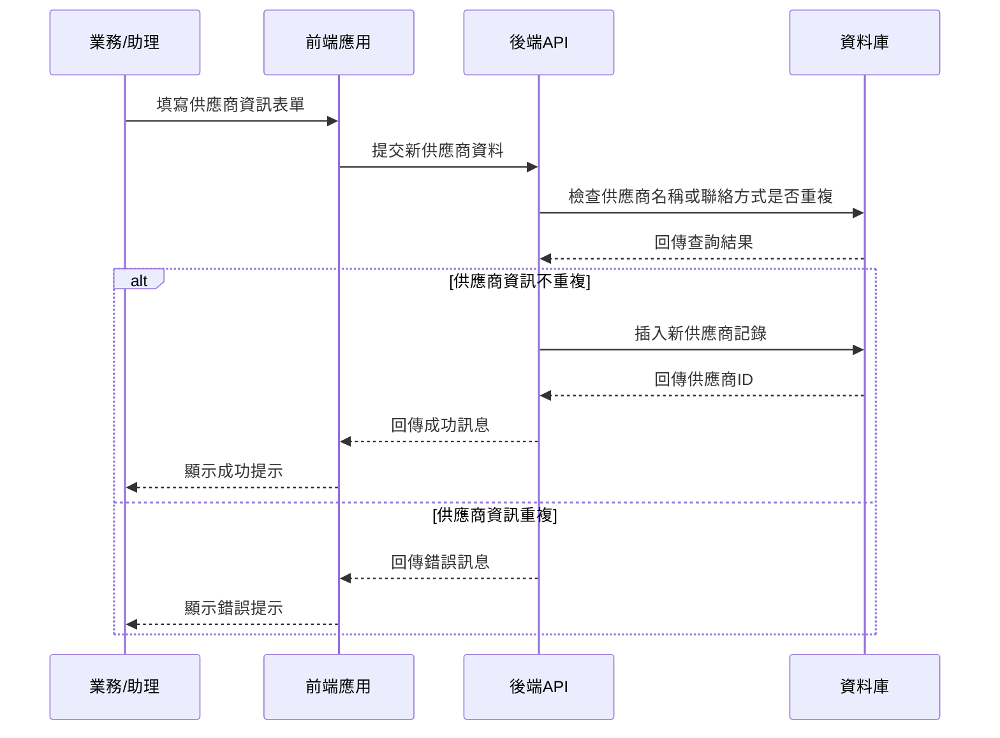
```mermaid
sequenceDiagram
    participant User as 業務/助理
    participant Frontend as 前端應用
    participant API as 後端API
    participant DB as 資料庫

    User->>Frontend: 填寫供應商資訊表單
    Frontend->>API: 提交新供應商資料
    API->>DB: 檢查供應商名稱或聯絡方式是否重複
    DB-->>API: 回傳查詢結果
    alt 供應商資訊不重複
        API->>DB: 插入新供應商記錄
        DB-->>API: 回傳供應商ID
        API-->>Frontend: 回傳成功訊息
        Frontend-->>User: 顯示成功提示
    else 供應商資訊重複
        API-->>Frontend: 回傳錯誤訊息
        Frontend-->>User: 顯示錯誤提示
    end
```

## 4. 訂單管理流程

### 4.1 建立客戶訂單
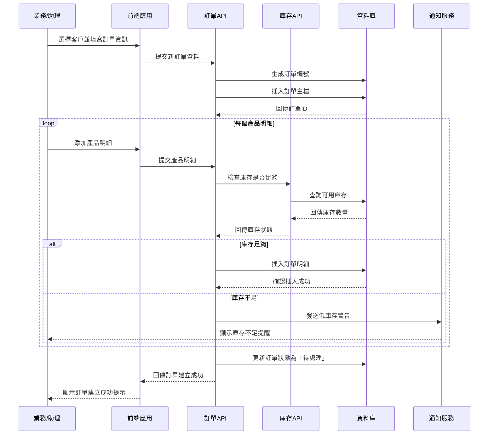
```mermaid
sequenceDiagram
    participant Sales as 業務/助理
    participant Frontend as 前端應用
    participant OrderAPI as 訂單API
    participant InventoryAPI as 庫存API
    participant DB as 資料庫
    participant NotificationService as 通知服務

    Sales->>Frontend: 選擇客戶並填寫訂單資訊
    Frontend->>OrderAPI: 提交新訂單資料
    OrderAPI->>DB: 生成訂單編號
    OrderAPI->>DB: 插入訂單主檔
    DB-->>OrderAPI: 回傳訂單ID
    
    loop 每個產品明細
        Sales->>Frontend: 添加產品明細
        Frontend->>OrderAPI: 提交產品明細
        OrderAPI->>InventoryAPI: 檢查庫存是否足夠
        InventoryAPI->>DB: 查詢可用庫存
        DB-->>InventoryAPI: 回傳庫存數量
        InventoryAPI-->>OrderAPI: 回傳庫存狀態
        
        alt 庫存足夠
            OrderAPI->>DB: 插入訂單明細
            DB-->>OrderAPI: 確認插入成功
        else 庫存不足
            OrderAPI->>NotificationService: 發送低庫存警告
            NotificationService-->>Sales: 顯示庫存不足提醒
        end
    end
    
    OrderAPI->>DB: 更新訂單狀態為「待處理」
    OrderAPI-->>Frontend: 回傳訂單建立成功
    Frontend-->>Sales: 顯示訂單建立成功提示
```

### 4.2 查詢訂單
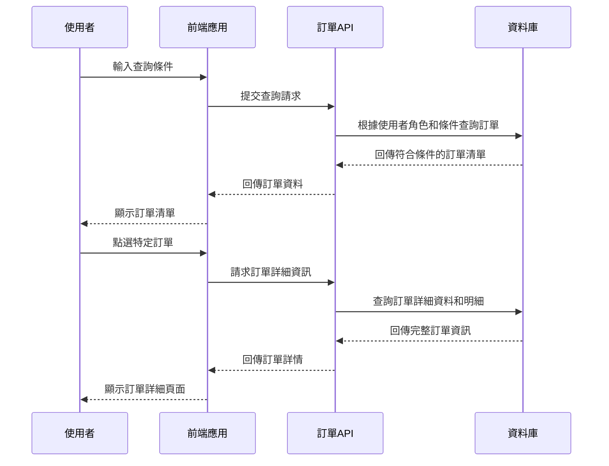
```mermaid
sequenceDiagram
    participant User as 使用者
    participant Frontend as 前端應用
    participant OrderAPI as 訂單API
    participant DB as 資料庫

    User->>Frontend: 輸入查詢條件
    Frontend->>OrderAPI: 提交查詢請求
    OrderAPI->>DB: 根據使用者角色和條件查詢訂單
    DB-->>OrderAPI: 回傳符合條件的訂單清單
    OrderAPI-->>Frontend: 回傳訂單資料
    Frontend-->>User: 顯示訂單清單
    
    User->>Frontend: 點選特定訂單
    Frontend->>OrderAPI: 請求訂單詳細資訊
    OrderAPI->>DB: 查詢訂單詳細資料和明細
    DB-->>OrderAPI: 回傳完整訂單資訊
    OrderAPI-->>Frontend: 回傳訂單詳情
    Frontend-->>User: 顯示訂單詳細頁面
```

### 4.3 更新訂單狀態
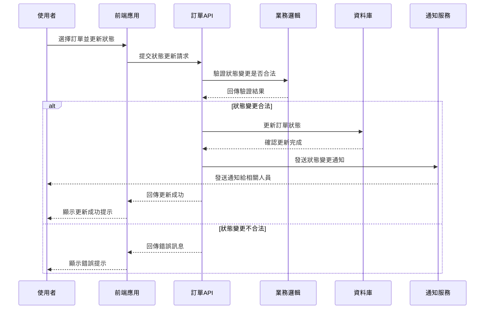
```mermaid
sequenceDiagram
    participant User as 使用者
    participant Frontend as 前端應用
    participant OrderAPI as 訂單API
    participant BusinessLogic as 業務邏輯
    participant DB as 資料庫
    participant NotificationService as 通知服務

    User->>Frontend: 選擇訂單並更新狀態
    Frontend->>OrderAPI: 提交狀態更新請求
    OrderAPI->>BusinessLogic: 驗證狀態變更是否合法
    BusinessLogic-->>OrderAPI: 回傳驗證結果
    
    alt 狀態變更合法
        OrderAPI->>DB: 更新訂單狀態
        DB-->>OrderAPI: 確認更新完成
        OrderAPI->>NotificationService: 發送狀態變更通知
        NotificationService-->>User: 發送通知給相關人員
        OrderAPI-->>Frontend: 回傳更新成功
        Frontend-->>User: 顯示更新成功提示
    else 狀態變更不合法
        OrderAPI-->>Frontend: 回傳錯誤訊息
        Frontend-->>User: 顯示錯誤提示
    end
```

## 5. 採購管理流程

### 5.1 建立採購單
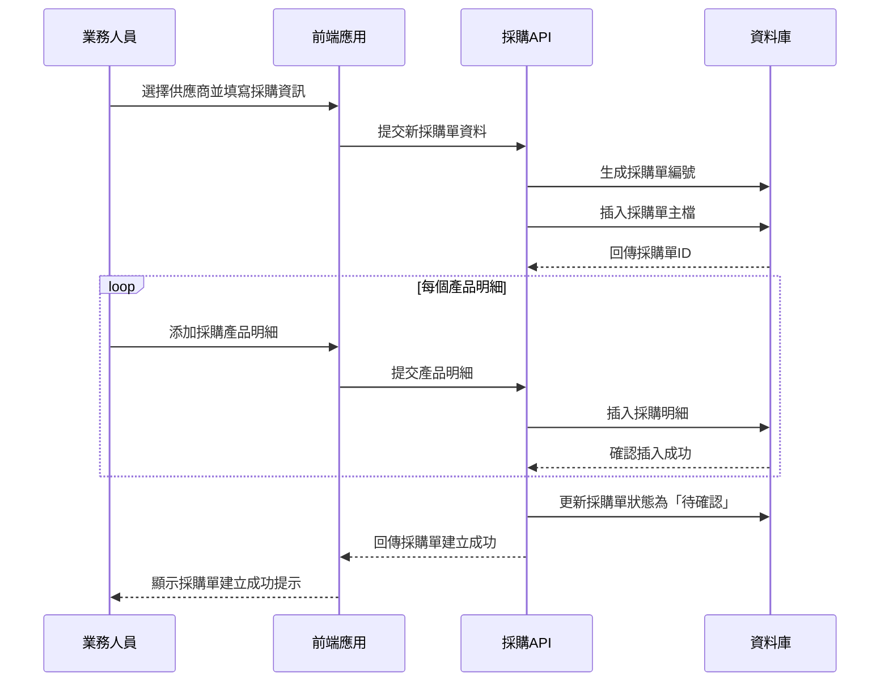
```mermaid
sequenceDiagram
    participant Sales as 業務人員
    participant Frontend as 前端應用
    participant PurchaseAPI as 採購API
    participant DB as 資料庫

    Sales->>Frontend: 選擇供應商並填寫採購資訊
    Frontend->>PurchaseAPI: 提交新採購單資料
    PurchaseAPI->>DB: 生成採購單編號
    PurchaseAPI->>DB: 插入採購單主檔
    DB-->>PurchaseAPI: 回傳採購單ID
    
    loop 每個產品明細
        Sales->>Frontend: 添加採購產品明細
        Frontend->>PurchaseAPI: 提交產品明細
        PurchaseAPI->>DB: 插入採購明細
        DB-->>PurchaseAPI: 確認插入成功
    end
    
    PurchaseAPI->>DB: 更新採購單狀態為「待確認」
    PurchaseAPI-->>Frontend: 回傳採購單建立成功
    Frontend-->>Sales: 顯示採購單建立成功提示
```

### 5.2 採購單狀態管理
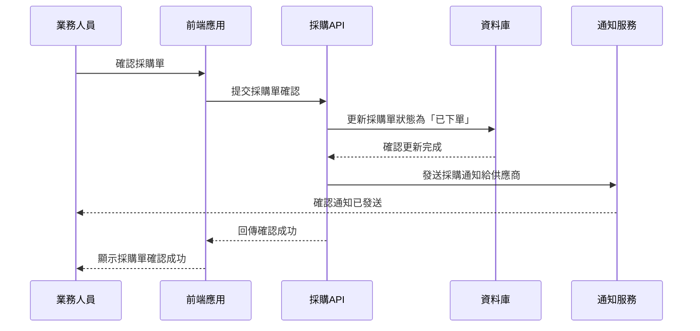
```mermaid
sequenceDiagram
    participant Sales as 業務人員
    participant Frontend as 前端應用
    participant PurchaseAPI as 採購API
    participant DB as 資料庫
    participant NotificationService as 通知服務

    Sales->>Frontend: 確認採購單
    Frontend->>PurchaseAPI: 提交採購單確認
    PurchaseAPI->>DB: 更新採購單狀態為「已下單」
    DB-->>PurchaseAPI: 確認更新完成
    PurchaseAPI->>NotificationService: 發送採購通知給供應商
    NotificationService-->>Sales: 確認通知已發送
    PurchaseAPI-->>Frontend: 回傳確認成功
    Frontend-->>Sales: 顯示採購單確認成功
```

## 6. 庫存管理流程

### 6.1 入庫作業
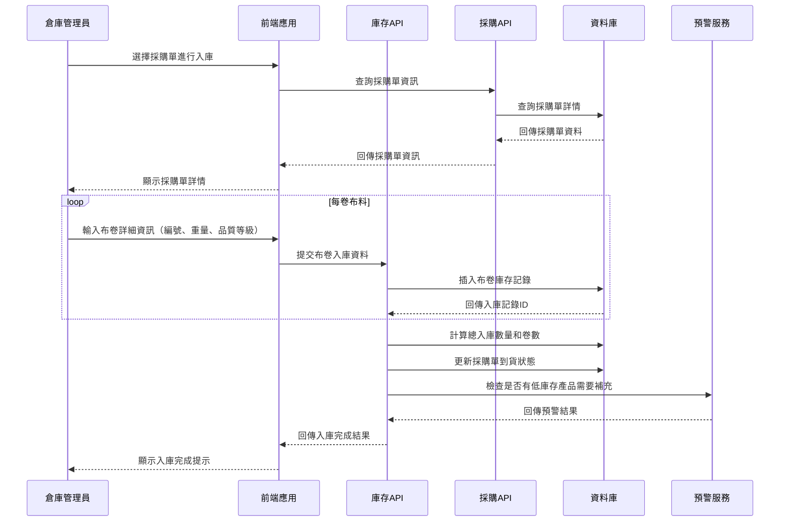
```mermaid
sequenceDiagram
    participant Warehouse as 倉庫管理員
    participant Frontend as 前端應用
    participant InventoryAPI as 庫存API
    participant PurchaseAPI as 採購API
    participant DB as 資料庫
    participant AlertService as 預警服務

    Warehouse->>Frontend: 選擇採購單進行入庫
    Frontend->>PurchaseAPI: 查詢採購單資訊
    PurchaseAPI->>DB: 查詢採購單詳情
    DB-->>PurchaseAPI: 回傳採購單資料
    PurchaseAPI-->>Frontend: 回傳採購單資訊
    Frontend-->>Warehouse: 顯示採購單詳情
    
    loop 每卷布料
        Warehouse->>Frontend: 輸入布卷詳細資訊（編號、重量、品質等級）
        Frontend->>InventoryAPI: 提交布卷入庫資料
        InventoryAPI->>DB: 插入布卷庫存記錄
        DB-->>InventoryAPI: 回傳入庫記錄ID
    end
    
    InventoryAPI->>DB: 計算總入庫數量和卷數
    InventoryAPI->>DB: 更新採購單到貨狀態
    InventoryAPI->>AlertService: 檢查是否有低庫存產品需要補充
    AlertService-->>InventoryAPI: 回傳預警結果
    InventoryAPI-->>Frontend: 回傳入庫完成結果
    Frontend-->>Warehouse: 顯示入庫完成提示
```

### 6.2 庫存查詢
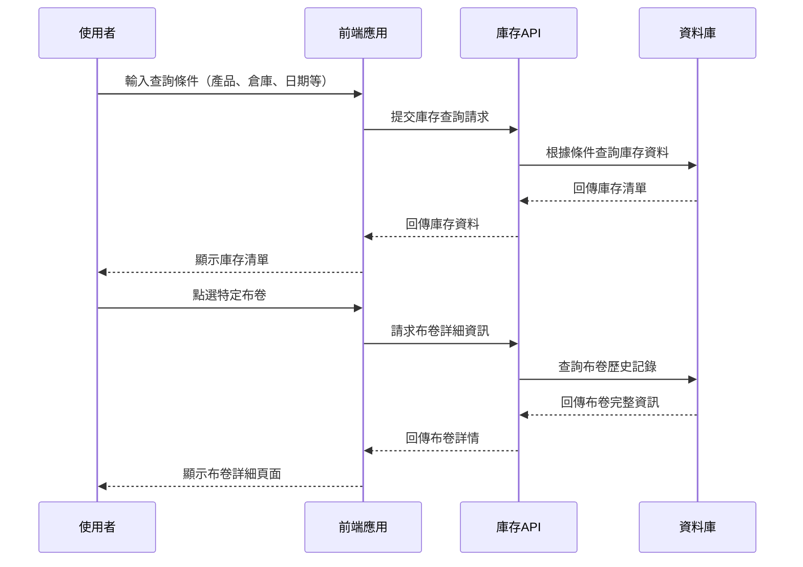
```mermaid
sequenceDiagram
    participant User as 使用者
    participant Frontend as 前端應用
    participant InventoryAPI as 庫存API
    participant DB as 資料庫

    User->>Frontend: 輸入查詢條件（產品、倉庫、日期等）
    Frontend->>InventoryAPI: 提交庫存查詢請求
    InventoryAPI->>DB: 根據條件查詢庫存資料
    DB-->>InventoryAPI: 回傳庫存清單
    InventoryAPI-->>Frontend: 回傳庫存資料
    Frontend-->>User: 顯示庫存清單
    
    User->>Frontend: 點選特定布卷
    Frontend->>InventoryAPI: 請求布卷詳細資訊
    InventoryAPI->>DB: 查詢布卷歷史記錄
    DB-->>InventoryAPI: 回傳布卷完整資訊
    InventoryAPI-->>Frontend: 回傳布卷詳情
    Frontend-->>User: 顯示布卷詳細頁面
```

## 7. 出貨管理流程

### 7.1 建立出貨單
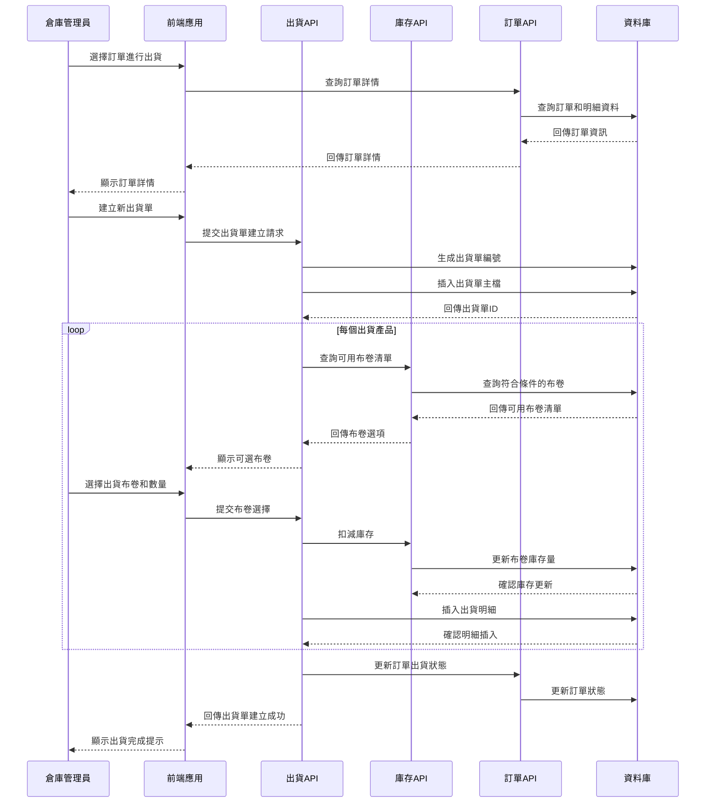
```mermaid
sequenceDiagram
    participant Warehouse as 倉庫管理員
    participant Frontend as 前端應用
    participant ShippingAPI as 出貨API
    participant InventoryAPI as 庫存API
    participant OrderAPI as 訂單API
    participant DB as 資料庫

    Warehouse->>Frontend: 選擇訂單進行出貨
    Frontend->>OrderAPI: 查詢訂單詳情
    OrderAPI->>DB: 查詢訂單和明細資料
    DB-->>OrderAPI: 回傳訂單資訊
    OrderAPI-->>Frontend: 回傳訂單詳情
    Frontend-->>Warehouse: 顯示訂單詳情
    
    Warehouse->>Frontend: 建立新出貨單
    Frontend->>ShippingAPI: 提交出貨單建立請求
    ShippingAPI->>DB: 生成出貨單編號
    ShippingAPI->>DB: 插入出貨單主檔
    DB-->>ShippingAPI: 回傳出貨單ID
    
    loop 每個出貨產品
        ShippingAPI->>InventoryAPI: 查詢可用布卷清單
        InventoryAPI->>DB: 查詢符合條件的布卷
        DB-->>InventoryAPI: 回傳可用布卷清單
        InventoryAPI-->>ShippingAPI: 回傳布卷選項
        ShippingAPI-->>Frontend: 顯示可選布卷
        Warehouse->>Frontend: 選擇出貨布卷和數量
        Frontend->>ShippingAPI: 提交布卷選擇
        ShippingAPI->>InventoryAPI: 扣減庫存
        InventoryAPI->>DB: 更新布卷庫存量
        DB-->>InventoryAPI: 確認庫存更新
        ShippingAPI->>DB: 插入出貨明細
        DB-->>ShippingAPI: 確認明細插入
    end
    
    ShippingAPI->>OrderAPI: 更新訂單出貨狀態
    OrderAPI->>DB: 更新訂單狀態
    ShippingAPI-->>Frontend: 回傳出貨單建立成功
    Frontend-->>Warehouse: 顯示出貨完成提示
```

### 7.2 出貨歷史查詢
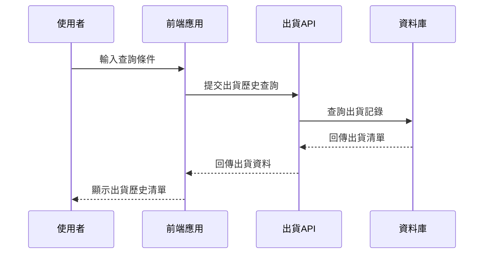
```mermaid
sequenceDiagram
    participant User as 使用者
    participant Frontend as 前端應用
    participant ShippingAPI as 出貨API
    participant DB as 資料庫

    User->>Frontend: 輸入查詢條件
    Frontend->>ShippingAPI: 提交出貨歷史查詢
    ShippingAPI->>DB: 查詢出貨記錄
    DB-->>ShippingAPI: 回傳出貨清單
    ShippingAPI-->>Frontend: 回傳出貨資料
    Frontend-->>User: 顯示出貨歷史清單
```

## 8. 庫存預警流程

### 8.1 設定庫存閾值
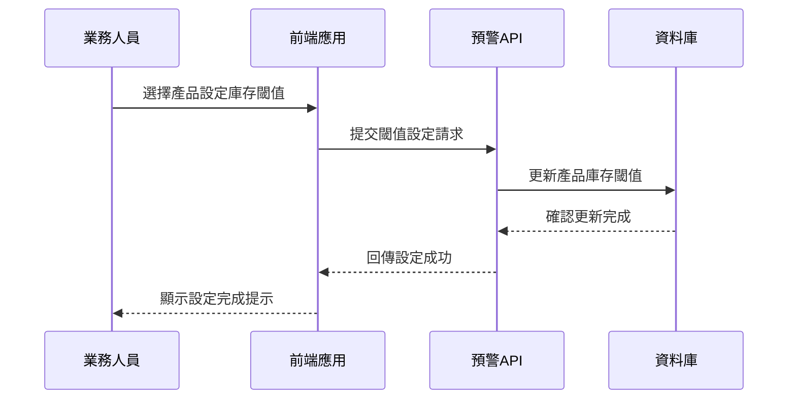
```mermaid
sequenceDiagram
    participant Sales as 業務人員
    participant Frontend as 前端應用
    participant AlertAPI as 預警API
    participant DB as 資料庫

    Sales->>Frontend: 選擇產品設定庫存閾值
    Frontend->>AlertAPI: 提交閾值設定請求
    AlertAPI->>DB: 更新產品庫存閾值
    DB-->>AlertAPI: 確認更新完成
    AlertAPI-->>Frontend: 回傳設定成功
    Frontend-->>Sales: 顯示設定完成提示
```

### 8.2 自動庫存預警
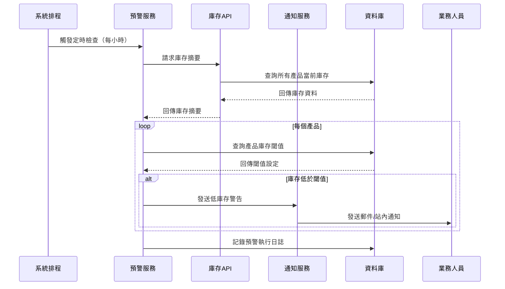
```mermaid
sequenceDiagram
    participant System as 系統排程
    participant AlertService as 預警服務
    participant InventoryAPI as 庫存API
    participant NotificationService as 通知服務
    participant DB as 資料庫
    participant Sales as 業務人員

    System->>AlertService: 觸發定時檢查（每小時）
    AlertService->>InventoryAPI: 請求庫存摘要
    InventoryAPI->>DB: 查詢所有產品當前庫存
    DB-->>InventoryAPI: 回傳庫存資料
    InventoryAPI-->>AlertService: 回傳庫存摘要
    
    loop 每個產品
        AlertService->>DB: 查詢產品庫存閾值
        DB-->>AlertService: 回傳閾值設定
        alt 庫存低於閾值
            AlertService->>NotificationService: 發送低庫存警告
            NotificationService->>Sales: 發送郵件/站內通知
        end
    end
    
    AlertService->>DB: 記錄預警執行日誌
```

## 9. 報表與分析流程

### 9.1 業務月度報表
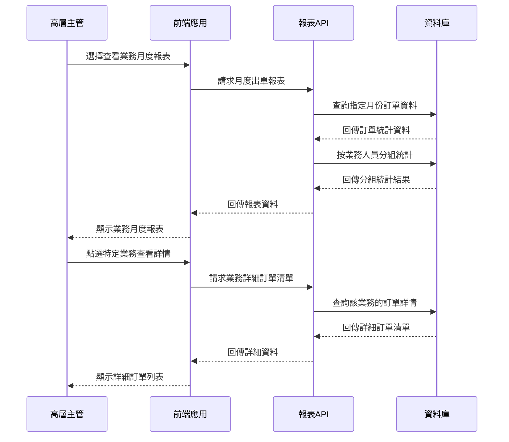
```mermaid
sequenceDiagram
    participant Manager as 高層主管
    participant Frontend as 前端應用
    participant ReportAPI as 報表API
    participant DB as 資料庫

    Manager->>Frontend: 選擇查看業務月度報表
    Frontend->>ReportAPI: 請求月度出單報表
    ReportAPI->>DB: 查詢指定月份訂單資料
    DB-->>ReportAPI: 回傳訂單統計資料
    ReportAPI->>DB: 按業務人員分組統計
    DB-->>ReportAPI: 回傳分組統計結果
    ReportAPI-->>Frontend: 回傳報表資料
    Frontend-->>Manager: 顯示業務月度報表
    
    Manager->>Frontend: 點選特定業務查看詳情
    Frontend->>ReportAPI: 請求業務詳細訂單清單
    ReportAPI->>DB: 查詢該業務的訂單詳情
    DB-->>ReportAPI: 回傳詳細訂單清單
    ReportAPI-->>Frontend: 回傳詳細資料
    Frontend-->>Manager: 顯示詳細訂單列表
```

### 9.2 營運儀表板
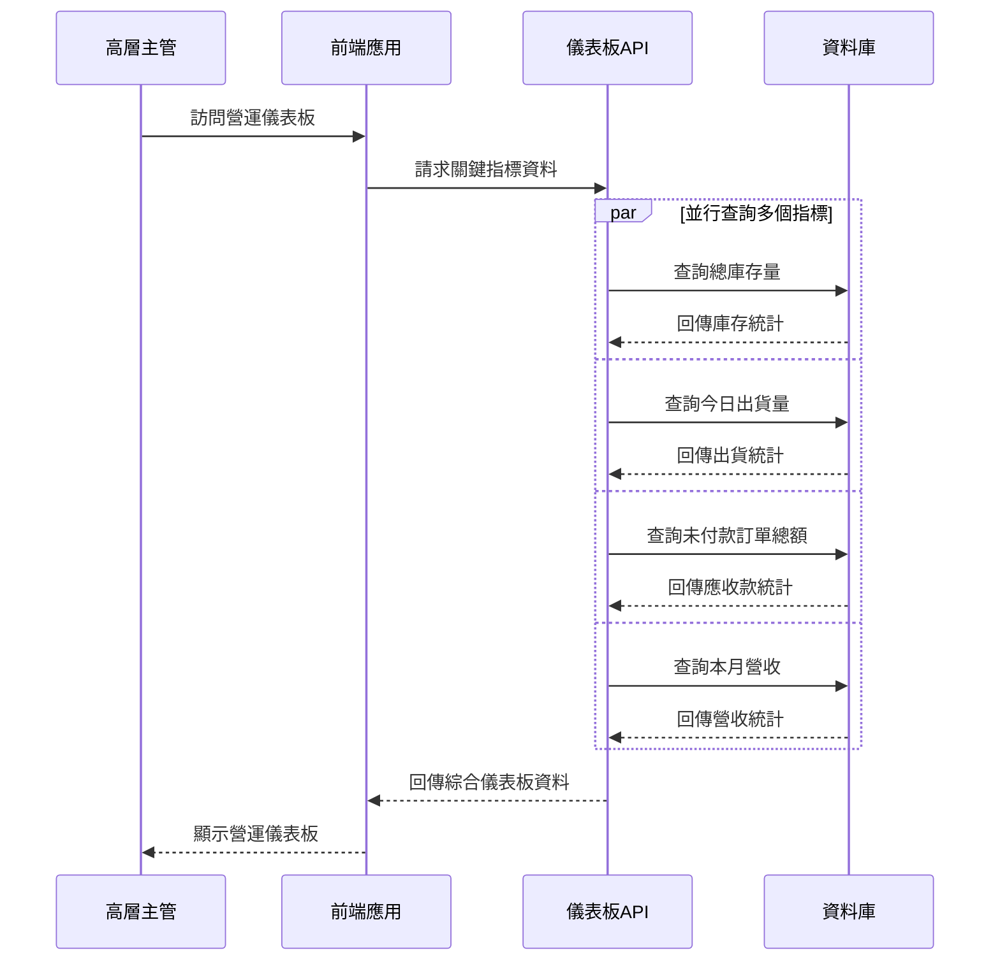
```mermaid
sequenceDiagram
    participant Manager as 高層主管
    participant Frontend as 前端應用
    participant DashboardAPI as 儀表板API
    participant DB as 資料庫

    Manager->>Frontend: 訪問營運儀表板
    Frontend->>DashboardAPI: 請求關鍵指標資料
    
    par 並行查詢多個指標
        DashboardAPI->>DB: 查詢總庫存量
        DB-->>DashboardAPI: 回傳庫存統計
    and
        DashboardAPI->>DB: 查詢今日出貨量
        DB-->>DashboardAPI: 回傳出貨統計
    and
        DashboardAPI->>DB: 查詢未付款訂單總額
        DB-->>DashboardAPI: 回傳應收款統計
    and
        DashboardAPI->>DB: 查詢本月營收
        DB-->>DashboardAPI: 回傳營收統計
    end
    
    DashboardAPI-->>Frontend: 回傳綜合儀表板資料
    Frontend-->>Manager: 顯示營運儀表板
```

## 10. 使用者與權限管理流程

### 10.1 建立新使用者
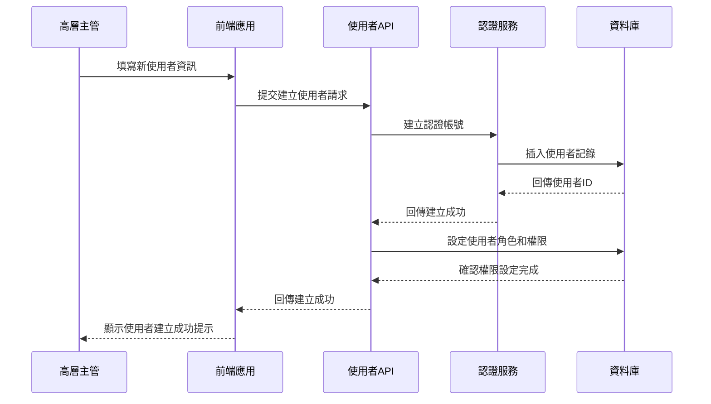
```mermaid
sequenceDiagram
    participant Admin as 高層主管
    participant Frontend as 前端應用
    participant UserAPI as 使用者API
    participant AuthService as 認證服務
    participant DB as 資料庫

    Admin->>Frontend: 填寫新使用者資訊
    Frontend->>UserAPI: 提交建立使用者請求
    UserAPI->>AuthService: 建立認證帳號
    AuthService->>DB: 插入使用者記錄
    DB-->>AuthService: 回傳使用者ID
    AuthService-->>UserAPI: 回傳建立成功
    UserAPI->>DB: 設定使用者角色和權限
    DB-->>UserAPI: 確認權限設定完成
    UserAPI-->>Frontend: 回傳建立成功
    Frontend-->>Admin: 顯示使用者建立成功提示
```

### 10.2 權限檢查
```mermaid
sequenceDiagram
    participant User as 使用者
    participant Frontend as 前端應用
    participant AuthService as 認證服務
    participant RLS as 行級安全策略
    participant DB as 資料庫

    User->>Frontend: 嘗試執行特定操作
    Frontend->>AuthService: 檢查操作權限
    AuthService->>DB: 查詢使用者角色
    DB-->>AuthService: 回傳角色資訊
    AuthService->>RLS: 驗證操作權限
    RLS-->>AuthService: 回傳權限檢查結果
    
    alt 有權限
        AuthService-->>Frontend: 允許操作
        Frontend-->>User: 執行請求的操作
    else 無權限
        AuthService-->>Frontend: 拒絕操作
        Frontend-->>User: 顯示權限不足錯誤
    end
```

## 總結

這些序列圖涵蓋了 PRD 中定義的所有核心功能，包括：

1. **認證與授權**：使用者登入、角色驗證
2. **產品管理**：新增、編輯產品
3. **客戶與供應商管理**：建立和維護客戶/供應商資料
4. **訂單管理**：建立、查詢、更新訂單狀態
5. **採購管理**：建立採購單、狀態管理
6. **庫存管理**：入庫作業、庫存查詢
7. **出貨管理**：建立出貨單、出貨歷史
8. **庫存預警**：閾值設定、自動預警
9. **報表分析**：業務報表、營運儀表板
10. **使用者權限管理**：使用者建立、權限檢查

每個序列圖都詳細描述了參與者之間的交互過程，為後續的類別圖設計和單元測試撰寫提供了清晰的藍圖。
