# 序列圖設計文檔

## 1. 概述

本文檔基於 DTDD (Document-driven Test-driven Development) 方法論，詳細描述紡織業多租戶組織 ERP 系統的關鍵業務流程序列圖。系統採用多租戶架構，所有業務流程都包含組織層級的權限檢查和數據隔離機制。

## 2. 組織管理流程

### 2.1 使用者登入和組織選擇流程

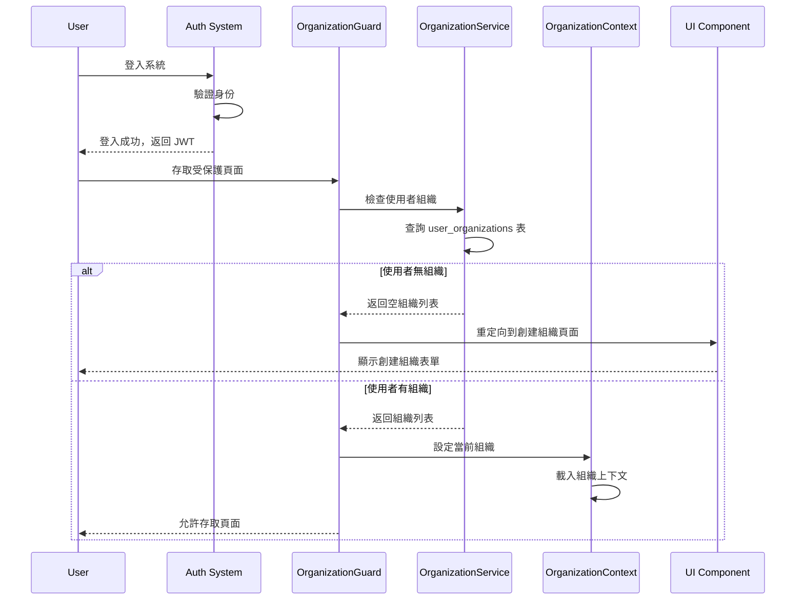
```mermaid
sequenceDiagram
    participant U as User
    participant A as Auth System
    participant OG as OrganizationGuard
    participant OS as OrganizationService
    participant OC as OrganizationContext
    participant UI as UI Component

    U->>A: 登入系統
    A->>A: 驗證身份
    A-->>U: 登入成功，返回 JWT
    
    U->>OG: 存取受保護頁面
    OG->>OS: 檢查使用者組織
    OS->>OS: 查詢 user_organizations 表
    
    alt 使用者無組織
        OS-->>OG: 返回空組織列表
        OG->>UI: 重定向到創建組織頁面
        UI-->>U: 顯示創建組織表單
    else 使用者有組織
        OS-->>OG: 返回組織列表
        OG->>OC: 設定當前組織
        OC->>OC: 載入組織上下文
        OG-->>U: 允許存取頁面
    end
```

### 2.2 創建組織流程

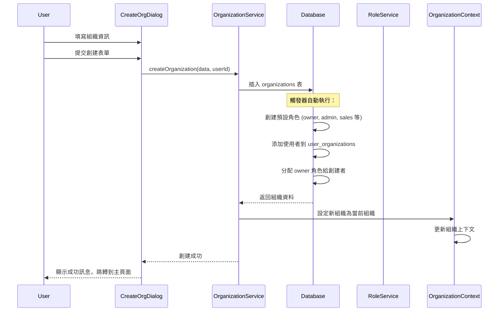
```mermaid
sequenceDiagram
    participant U as User
    participant UI as CreateOrgDialog
    participant OS as OrganizationService
    participant DB as Database
    participant RS as RoleService
    participant OC as OrganizationContext

    U->>UI: 填寫組織資訊
    U->>UI: 提交創建表單
    UI->>OS: createOrganization(data, userId)
    
    OS->>DB: 插入 organizations 表
    Note over DB: 觸發器自動執行：
    DB->>DB: 創建預設角色 (owner, admin, sales 等)
    DB->>DB: 添加使用者到 user_organizations
    DB->>DB: 分配 owner 角色給創建者
    
    DB-->>OS: 返回組織資料
    OS->>OC: 設定新組織為當前組織
    OC->>OC: 更新組織上下文
    OS-->>UI: 創建成功
    UI-->>U: 顯示成功訊息，跳轉到主頁面
```

### 2.3 組織切換流程

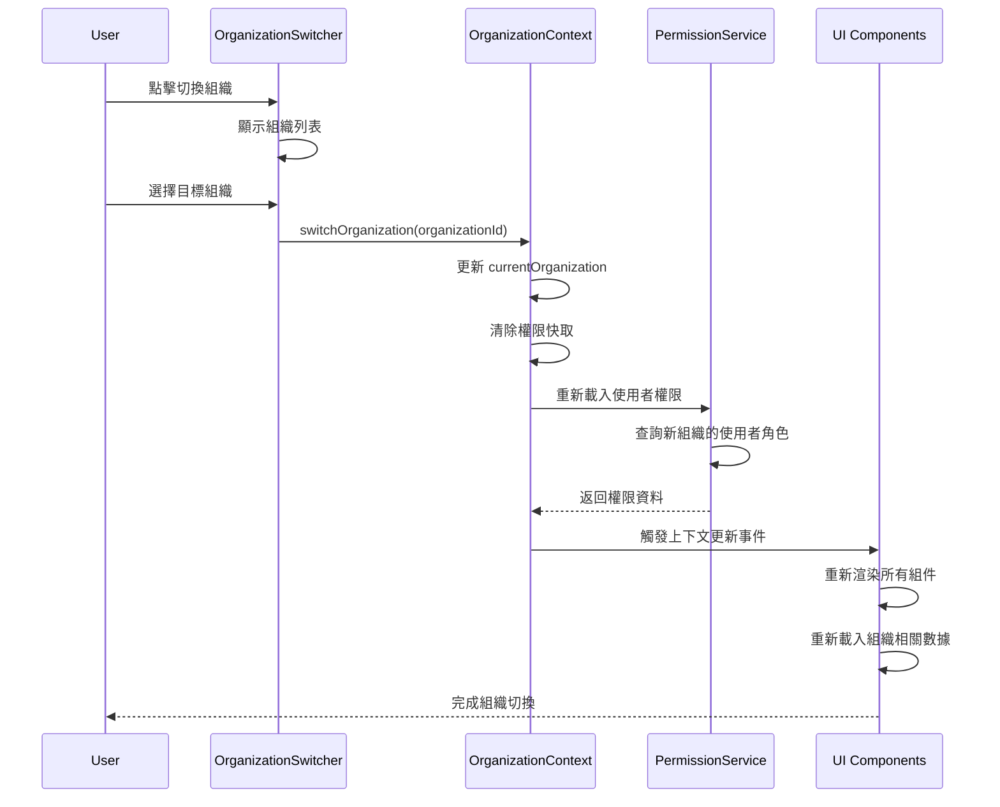
```mermaid
sequenceDiagram
    participant U as User
    participant SW as OrganizationSwitcher
    participant OC as OrganizationContext
    participant PS as PermissionService
    participant UI as UI Components

    U->>SW: 點擊切換組織
    SW->>SW: 顯示組織列表
    U->>SW: 選擇目標組織
    
    SW->>OC: switchOrganization(organizationId)
    OC->>OC: 更新 currentOrganization
    OC->>OC: 清除權限快取
    OC->>PS: 重新載入使用者權限
    PS->>PS: 查詢新組織的使用者角色
    PS-->>OC: 返回權限資料
    
    OC->>UI: 觸發上下文更新事件
    UI->>UI: 重新渲染所有組件
    UI->>UI: 重新載入組織相關數據
    UI-->>U: 完成組織切換
```

### 2.4 組織成員邀請流程

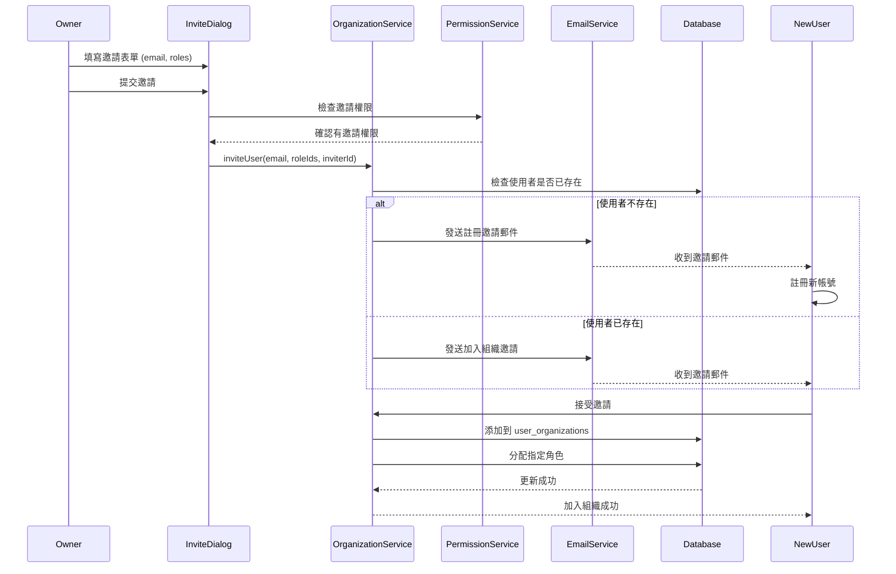
```mermaid
sequenceDiagram
    participant O as Owner
    participant UI as InviteDialog
    participant OS as OrganizationService
    participant PS as PermissionService
    participant ES as EmailService
    participant DB as Database
    participant N as NewUser

    O->>UI: 填寫邀請表單 (email, roles)
    O->>UI: 提交邀請
    UI->>PS: 檢查邀請權限
    PS-->>UI: 確認有邀請權限
    
    UI->>OS: inviteUser(email, roleIds, inviterId)
    OS->>DB: 檢查使用者是否已存在
    
    alt 使用者不存在
        OS->>ES: 發送註冊邀請郵件
        ES-->>N: 收到邀請郵件
        N->>N: 註冊新帳號
    else 使用者已存在
        OS->>ES: 發送加入組織邀請
        ES-->>N: 收到邀請郵件
    end
    
    N->>OS: 接受邀請
    OS->>DB: 添加到 user_organizations
    OS->>DB: 分配指定角色
    DB-->>OS: 更新成功
    OS-->>N: 加入組織成功
```

## 3. 權限管理流程

### 3.1 角色創建流程

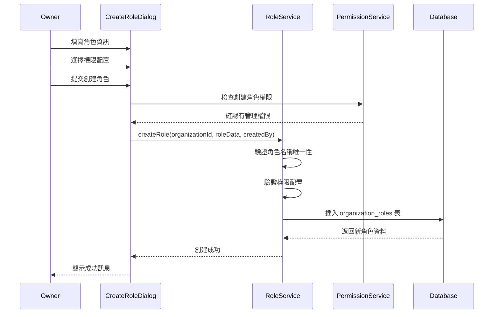
```mermaid
sequenceDiagram
    participant O as Owner
    participant UI as CreateRoleDialog
    participant RS as RoleService
    participant PS as PermissionService
    participant DB as Database

    O->>UI: 填寫角色資訊
    O->>UI: 選擇權限配置
    O->>UI: 提交創建角色
    
    UI->>PS: 檢查創建角色權限
    PS-->>UI: 確認有管理權限
    
    UI->>RS: createRole(organizationId, roleData, createdBy)
    RS->>RS: 驗證角色名稱唯一性
    RS->>RS: 驗證權限配置
    RS->>DB: 插入 organization_roles 表
    DB-->>RS: 返回新角色資料
    RS-->>UI: 創建成功
    UI-->>O: 顯示成功訊息
```

### 3.2 使用者角色分配流程

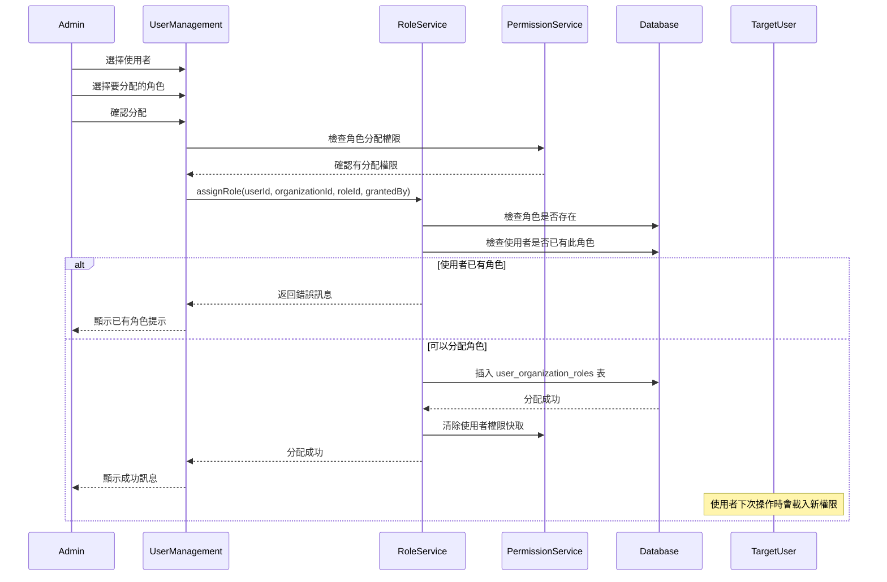
```mermaid
sequenceDiagram
    participant A as Admin
    participant UI as UserManagement
    participant RS as RoleService
    participant PS as PermissionService
    participant DB as Database
    participant U as TargetUser

    A->>UI: 選擇使用者
    A->>UI: 選擇要分配的角色
    A->>UI: 確認分配
    
    UI->>PS: 檢查角色分配權限
    PS-->>UI: 確認有分配權限
    
    UI->>RS: assignRole(userId, organizationId, roleId, grantedBy)
    RS->>DB: 檢查角色是否存在
    RS->>DB: 檢查使用者是否已有此角色
    
    alt 使用者已有角色
        RS-->>UI: 返回錯誤訊息
        UI-->>A: 顯示已有角色提示
    else 可以分配角色
        RS->>DB: 插入 user_organization_roles 表
        DB-->>RS: 分配成功
        RS->>PS: 清除使用者權限快取
        RS-->>UI: 分配成功
        UI-->>A: 顯示成功訊息
        
        Note over U: 使用者下次操作時會載入新權限
    end
```

### 3.3 權限檢查流程

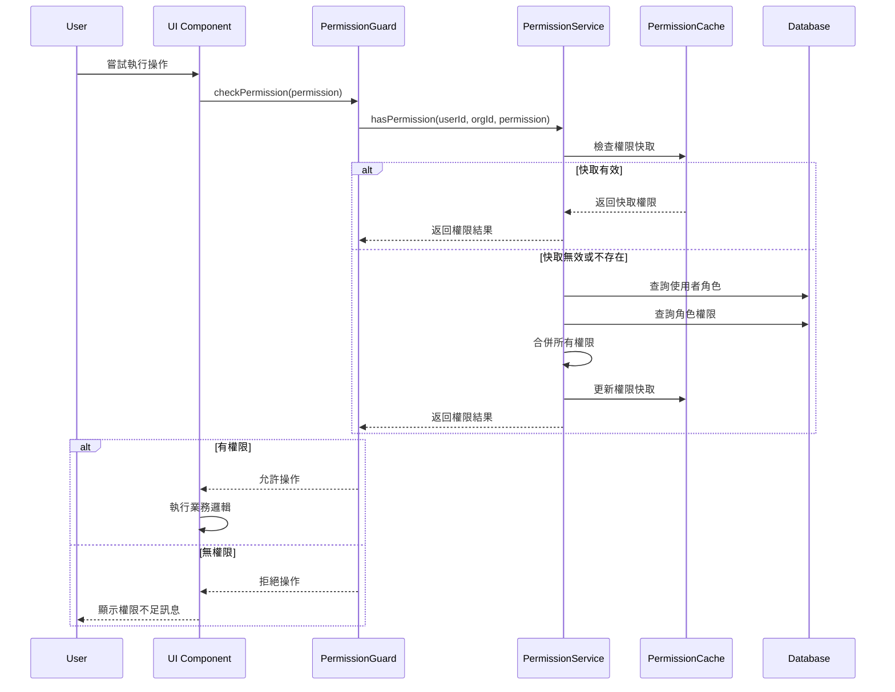
```mermaid
sequenceDiagram
    participant U as User
    participant UI as UI Component
    participant PG as PermissionGuard
    participant PS as PermissionService
    participant Cache as PermissionCache
    participant DB as Database

    U->>UI: 嘗試執行操作
    UI->>PG: checkPermission(permission)
    PG->>PS: hasPermission(userId, orgId, permission)
    
    PS->>Cache: 檢查權限快取
    
    alt 快取有效
        Cache-->>PS: 返回快取權限
        PS-->>PG: 返回權限結果
    else 快取無效或不存在
        PS->>DB: 查詢使用者角色
        PS->>DB: 查詢角色權限
        PS->>PS: 合併所有權限
        PS->>Cache: 更新權限快取
        PS-->>PG: 返回權限結果
    end
    
    alt 有權限
        PG-->>UI: 允許操作
        UI->>UI: 執行業務邏輯
    else 無權限
        PG-->>UI: 拒絕操作
        UI-->>U: 顯示權限不足訊息
    end
```

## 4. 核心業務流程

### 4.1 創建產品流程 (多租戶)

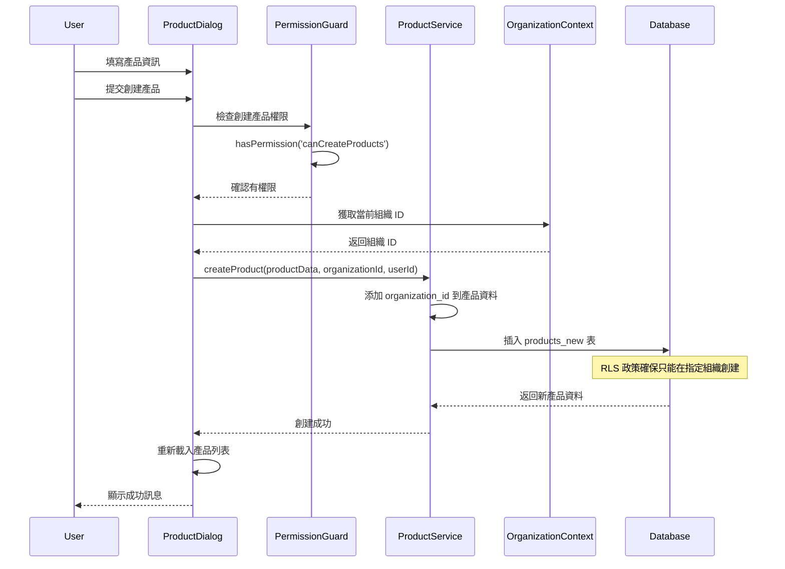
```mermaid
sequenceDiagram
    participant U as User
    participant UI as ProductDialog
    participant PG as PermissionGuard
    participant PS as ProductService
    participant OC as OrganizationContext
    participant DB as Database

    U->>UI: 填寫產品資訊
    U->>UI: 提交創建產品
    
    UI->>PG: 檢查創建產品權限
    PG->>PG: hasPermission('canCreateProducts')
    PG-->>UI: 確認有權限
    
    UI->>OC: 獲取當前組織 ID
    OC-->>UI: 返回組織 ID
    
    UI->>PS: createProduct(productData, organizationId, userId)
    PS->>PS: 添加 organization_id 到產品資料
    PS->>DB: 插入 products_new 表
    
    Note over DB: RLS 政策確保只能在指定組織創建
    
    DB-->>PS: 返回新產品資料
    PS-->>UI: 創建成功
    UI->>UI: 重新載入產品列表
    UI-->>U: 顯示成功訊息
```

### 4.2 查看訂單列表流程 (多租戶)

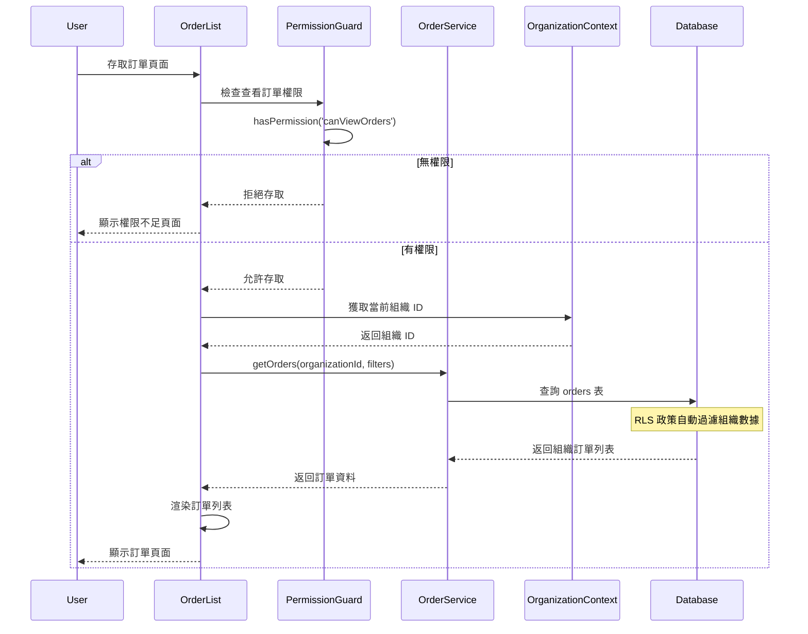
```mermaid
sequenceDiagram
    participant U as User
    participant UI as OrderList
    participant PG as PermissionGuard
    participant OS as OrderService
    participant OC as OrganizationContext
    participant DB as Database

    U->>UI: 存取訂單頁面
    UI->>PG: 檢查查看訂單權限
    PG->>PG: hasPermission('canViewOrders')
    
    alt 無權限
        PG-->>UI: 拒絕存取
        UI-->>U: 顯示權限不足頁面
    else 有權限
        PG-->>UI: 允許存取
        UI->>OC: 獲取當前組織 ID
        OC-->>UI: 返回組織 ID
        
        UI->>OS: getOrders(organizationId, filters)
        OS->>DB: 查詢 orders 表
        
        Note over DB: RLS 政策自動過濾組織數據
        
        DB-->>OS: 返回組織訂單列表
        OS-->>UI: 返回訂單資料
        UI->>UI: 渲染訂單列表
        UI-->>U: 顯示訂單頁面
    end
```

### 4.3 創建訂單流程 (多租戶)

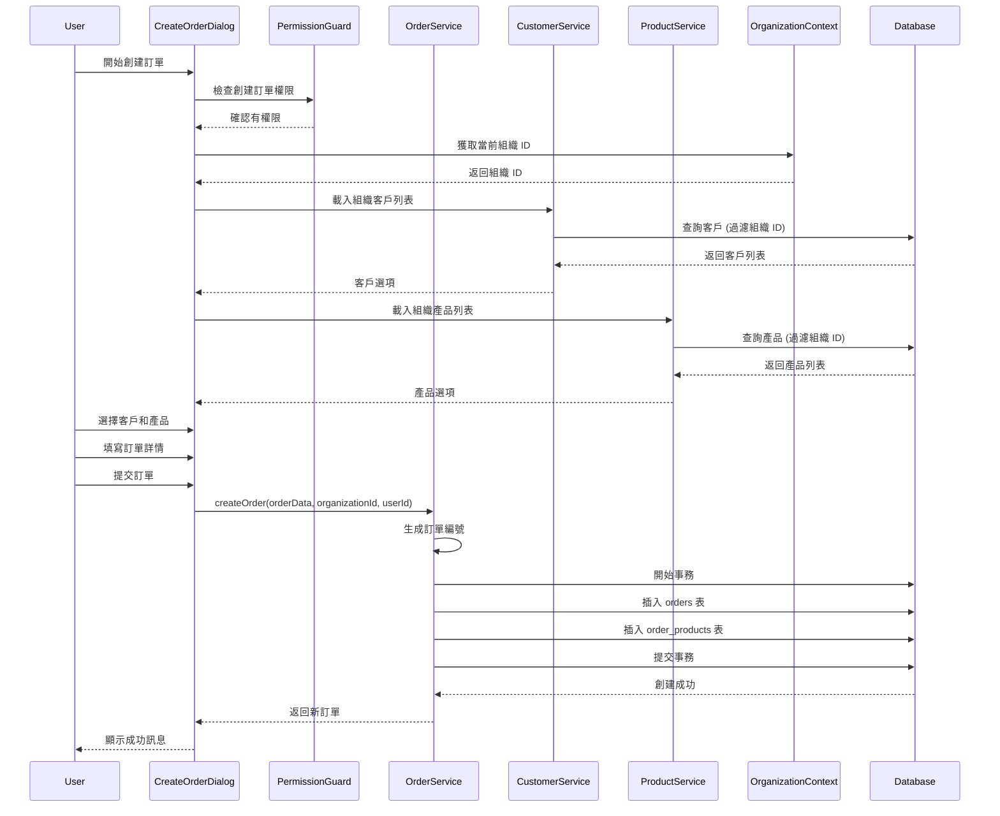
```mermaid
sequenceDiagram
    participant U as User
    participant UI as CreateOrderDialog
    participant PG as PermissionGuard
    participant OS as OrderService
    participant CS as CustomerService
    participant PS as ProductService
    participant OC as OrganizationContext
    participant DB as Database

    U->>UI: 開始創建訂單
    UI->>PG: 檢查創建訂單權限
    PG-->>UI: 確認有權限
    
    UI->>OC: 獲取當前組織 ID
    OC-->>UI: 返回組織 ID
    
    UI->>CS: 載入組織客戶列表
    CS->>DB: 查詢客戶 (過濾組織 ID)
    DB-->>CS: 返回客戶列表
    CS-->>UI: 客戶選項
    
    UI->>PS: 載入組織產品列表
    PS->>DB: 查詢產品 (過濾組織 ID)
    DB-->>PS: 返回產品列表
    PS-->>UI: 產品選項
    
    U->>UI: 選擇客戶和產品
    U->>UI: 填寫訂單詳情
    U->>UI: 提交訂單
    
    UI->>OS: createOrder(orderData, organizationId, userId)
    OS->>OS: 生成訂單編號
    OS->>DB: 開始事務
    OS->>DB: 插入 orders 表
    OS->>DB: 插入 order_products 表
    OS->>DB: 提交事務
    
    DB-->>OS: 創建成功
    OS-->>UI: 返回新訂單
    UI-->>U: 顯示成功訊息
```

### 4.4 庫存入庫流程 (多租戶)

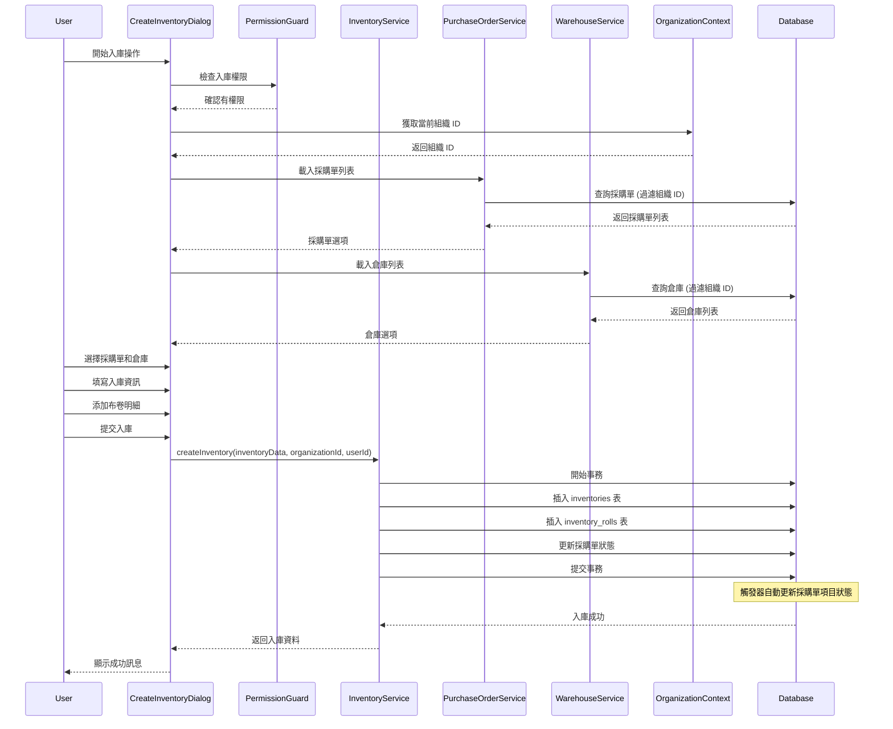
```mermaid
sequenceDiagram
    participant U as User
    participant UI as CreateInventoryDialog
    participant PG as PermissionGuard
    participant IS as InventoryService
    participant POS as PurchaseOrderService
    participant WS as WarehouseService
    participant OC as OrganizationContext
    participant DB as Database

    U->>UI: 開始入庫操作
    UI->>PG: 檢查入庫權限
    PG-->>UI: 確認有權限
    
    UI->>OC: 獲取當前組織 ID
    OC-->>UI: 返回組織 ID
    
    UI->>POS: 載入採購單列表
    POS->>DB: 查詢採購單 (過濾組織 ID)
    DB-->>POS: 返回採購單列表
    POS-->>UI: 採購單選項
    
    UI->>WS: 載入倉庫列表
    WS->>DB: 查詢倉庫 (過濾組織 ID)
    DB-->>WS: 返回倉庫列表
    WS-->>UI: 倉庫選項
    
    U->>UI: 選擇採購單和倉庫
    U->>UI: 填寫入庫資訊
    U->>UI: 添加布卷明細
    U->>UI: 提交入庫
    
    UI->>IS: createInventory(inventoryData, organizationId, userId)
    IS->>DB: 開始事務
    IS->>DB: 插入 inventories 表
    IS->>DB: 插入 inventory_rolls 表
    IS->>DB: 更新採購單狀態
    IS->>DB: 提交事務
    
    Note over DB: 觸發器自動更新採購單項目狀態
    
    DB-->>IS: 入庫成功
    IS-->>UI: 返回入庫資料
    UI-->>U: 顯示成功訊息
```

### 4.5 出貨處理流程 (多租戶)

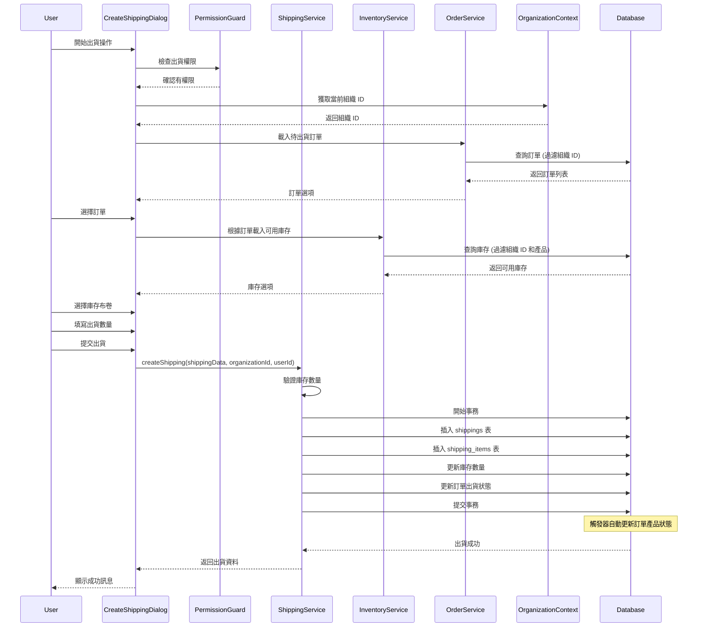
```mermaid
sequenceDiagram
    participant U as User
    participant UI as CreateShippingDialog
    participant PG as PermissionGuard
    participant SS as ShippingService
    participant IS as InventoryService
    participant OS as OrderService
    participant OC as OrganizationContext
    participant DB as Database

    U->>UI: 開始出貨操作
    UI->>PG: 檢查出貨權限
    PG-->>UI: 確認有權限
    
    UI->>OC: 獲取當前組織 ID
    OC-->>UI: 返回組織 ID
    
    UI->>OS: 載入待出貨訂單
    OS->>DB: 查詢訂單 (過濾組織 ID)
    DB-->>OS: 返回訂單列表
    OS-->>UI: 訂單選項
    
    U->>UI: 選擇訂單
    UI->>IS: 根據訂單載入可用庫存
    IS->>DB: 查詢庫存 (過濾組織 ID 和產品)
    DB-->>IS: 返回可用庫存
    IS-->>UI: 庫存選項
    
    U->>UI: 選擇庫存布卷
    U->>UI: 填寫出貨數量
    U->>UI: 提交出貨
    
    UI->>SS: createShipping(shippingData, organizationId, userId)
    SS->>SS: 驗證庫存數量
    SS->>DB: 開始事務
    SS->>DB: 插入 shippings 表
    SS->>DB: 插入 shipping_items 表
    SS->>DB: 更新庫存數量
    SS->>DB: 更新訂單出貨狀態
    SS->>DB: 提交事務
    
    Note over DB: 觸發器自動更新訂單產品狀態
    
    DB-->>SS: 出貨成功
    SS-->>UI: 返回出貨資料
    UI-->>U: 顯示成功訊息
```

## 5. 系統整合流程

### 5.1 應用啟動和組織初始化流程

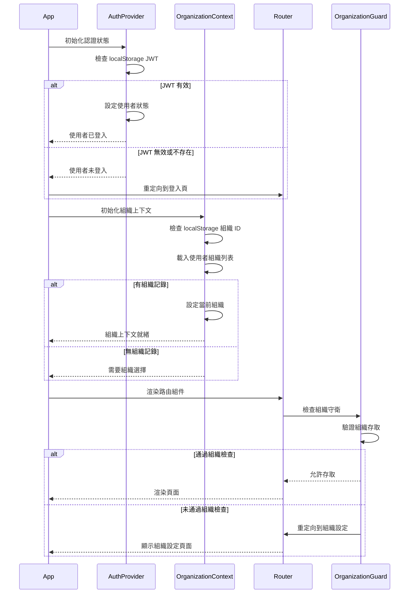
```mermaid
sequenceDiagram
    participant App as App
    participant Auth as AuthProvider
    participant OC as OrganizationContext
    participant Router as Router
    participant OG as OrganizationGuard

    App->>Auth: 初始化認證狀態
    Auth->>Auth: 檢查 localStorage JWT
    
    alt JWT 有效
        Auth->>Auth: 設定使用者狀態
        Auth-->>App: 使用者已登入
    else JWT 無效或不存在
        Auth-->>App: 使用者未登入
        App->>Router: 重定向到登入頁
    end
    
    App->>OC: 初始化組織上下文
    OC->>OC: 檢查 localStorage 組織 ID
    OC->>OC: 載入使用者組織列表
    
    alt 有組織記錄
        OC->>OC: 設定當前組織
        OC-->>App: 組織上下文就緒
    else 無組織記錄
        OC-->>App: 需要組織選擇
    end
    
    App->>Router: 渲染路由組件
    Router->>OG: 檢查組織守衛
    OG->>OG: 驗證組織存取
    
    alt 通過組織檢查
        OG-->>Router: 允許存取
        Router-->>App: 渲染頁面
    else 未通過組織檢查
        OG->>Router: 重定向到組織設定
        Router-->>App: 顯示組織設定頁面
    end
```

### 5.2 錯誤處理和恢復流程

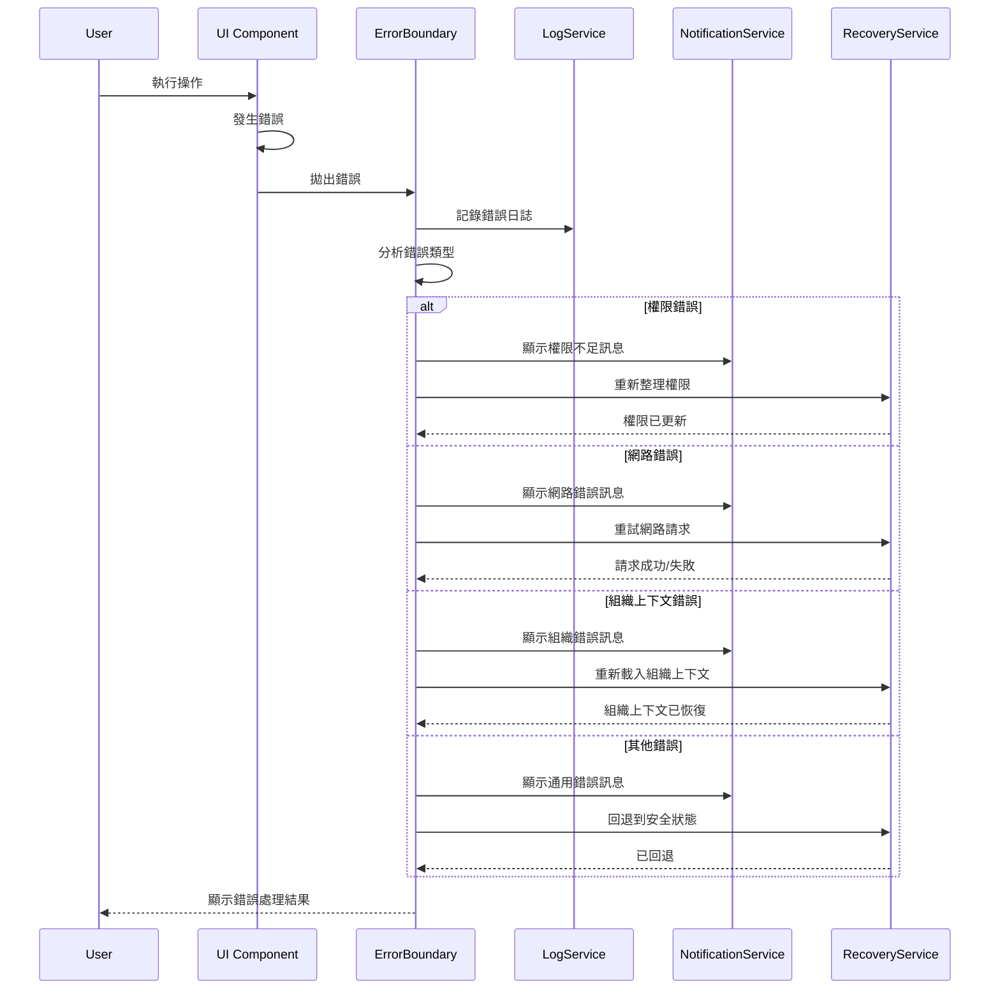
```mermaid
sequenceDiagram
    participant U as User
    participant UI as UI Component
    participant ES as ErrorBoundary
    participant LS as LogService
    participant NS as NotificationService
    participant Recovery as RecoveryService

    U->>UI: 執行操作
    UI->>UI: 發生錯誤
    UI->>ES: 拋出錯誤
    
    ES->>LS: 記錄錯誤日誌
    ES->>ES: 分析錯誤類型
    
    alt 權限錯誤
        ES->>NS: 顯示權限不足訊息
        ES->>Recovery: 重新整理權限
        Recovery-->>ES: 權限已更新
    else 網路錯誤
        ES->>NS: 顯示網路錯誤訊息
        ES->>Recovery: 重試網路請求
        Recovery-->>ES: 請求成功/失敗
    else 組織上下文錯誤
        ES->>NS: 顯示組織錯誤訊息
        ES->>Recovery: 重新載入組織上下文
        Recovery-->>ES: 組織上下文已恢復
    else 其他錯誤
        ES->>NS: 顯示通用錯誤訊息
        ES->>Recovery: 回退到安全狀態
        Recovery-->>ES: 已回退
    end
    
    ES-->>U: 顯示錯誤處理結果
```

## 6. 效能最佳化流程

### 6.1 權限快取機制流程

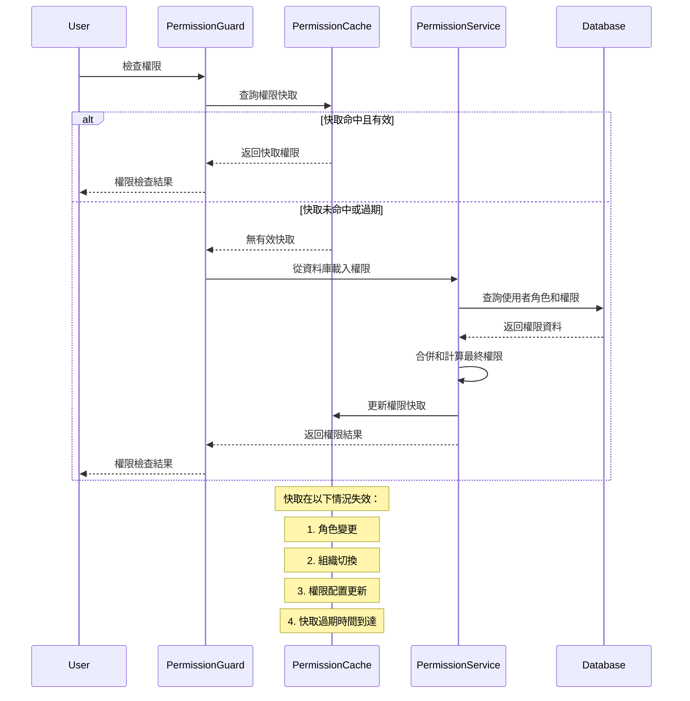
```mermaid
sequenceDiagram
    participant U as User
    participant PG as PermissionGuard
    participant Cache as PermissionCache
    participant PS as PermissionService
    participant DB as Database

    U->>PG: 檢查權限
    PG->>Cache: 查詢權限快取
    
    alt 快取命中且有效
        Cache-->>PG: 返回快取權限
        PG-->>U: 權限檢查結果
    else 快取未命中或過期
        Cache-->>PG: 無有效快取
        PG->>PS: 從資料庫載入權限
        PS->>DB: 查詢使用者角色和權限
        DB-->>PS: 返回權限資料
        PS->>PS: 合併和計算最終權限
        PS->>Cache: 更新權限快取
        PS-->>PG: 返回權限結果
        PG-->>U: 權限檢查結果
    end
    
    Note over Cache: 快取在以下情況失效：
    Note over Cache: 1. 角色變更
    Note over Cache: 2. 組織切換
    Note over Cache: 3. 權限配置更新
    Note over Cache: 4. 快取過期時間到達
```

### 6.2 數據預載入流程

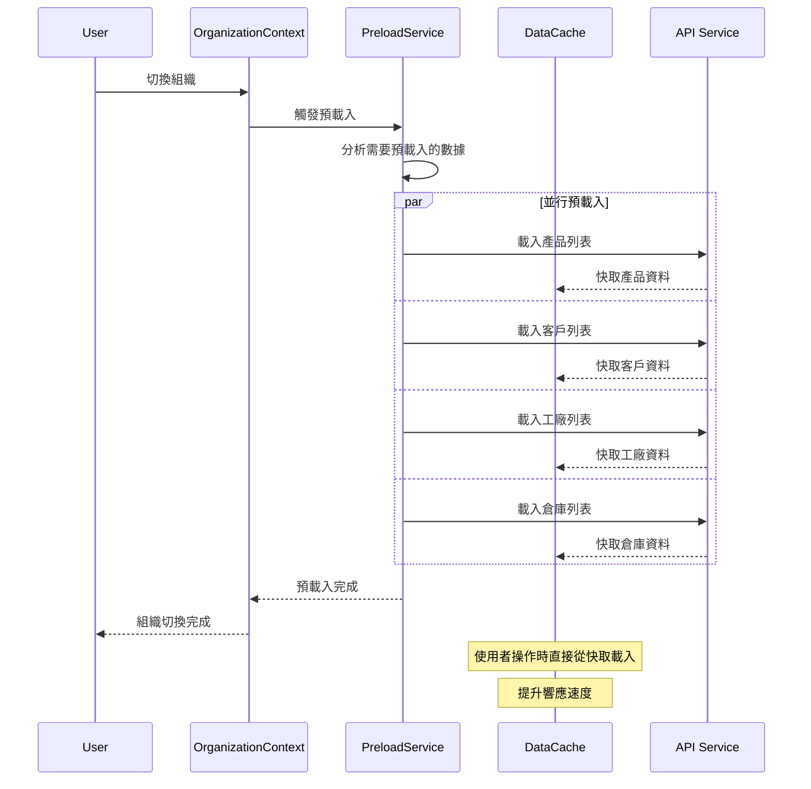
```mermaid
sequenceDiagram
    participant U as User
    participant OC as OrganizationContext
    participant PS as PreloadService
    participant Cache as DataCache
    participant API as API Service

    U->>OC: 切換組織
    OC->>PS: 觸發預載入
    PS->>PS: 分析需要預載入的數據
    
    par 並行預載入
        PS->>API: 載入產品列表
        API-->>Cache: 快取產品資料
    and
        PS->>API: 載入客戶列表
        API-->>Cache: 快取客戶資料
    and
        PS->>API: 載入工廠列表
        API-->>Cache: 快取工廠資料
    and
        PS->>API: 載入倉庫列表
        API-->>Cache: 快取倉庫資料
    end
    
    PS-->>OC: 預載入完成
    OC-->>U: 組織切換完成
    
    Note over Cache: 使用者操作時直接從快取載入
    Note over Cache: 提升響應速度
```

## 7. 安全控制流程

### 7.1 資料存取安全檢查流程

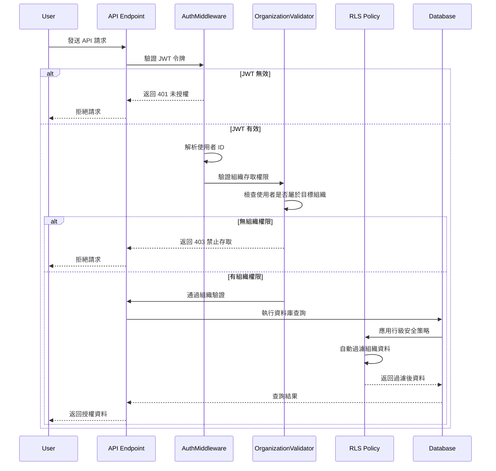
```mermaid
sequenceDiagram
    participant U as User
    participant API as API Endpoint
    participant Auth as AuthMiddleware
    participant OV as OrganizationValidator
    participant RLS as RLS Policy
    participant DB as Database

    U->>API: 發送 API 請求
    API->>Auth: 驗證 JWT 令牌
    
    alt JWT 無效
        Auth-->>API: 返回 401 未授權
        API-->>U: 拒絕請求
    else JWT 有效
        Auth->>Auth: 解析使用者 ID
        Auth->>OV: 驗證組織存取權限
        OV->>OV: 檢查使用者是否屬於目標組織
        
        alt 無組織權限
            OV-->>API: 返回 403 禁止存取
            API-->>U: 拒絕請求
        else 有組織權限
            OV->>API: 通過組織驗證
            API->>DB: 執行資料庫查詢
            DB->>RLS: 應用行級安全策略
            RLS->>RLS: 自動過濾組織資料
            RLS-->>DB: 返回過濾後資料
            DB-->>API: 查詢結果
            API-->>U: 返回授權資料
        end
    end
```

### 7.2 跨組織操作安全檢查流程

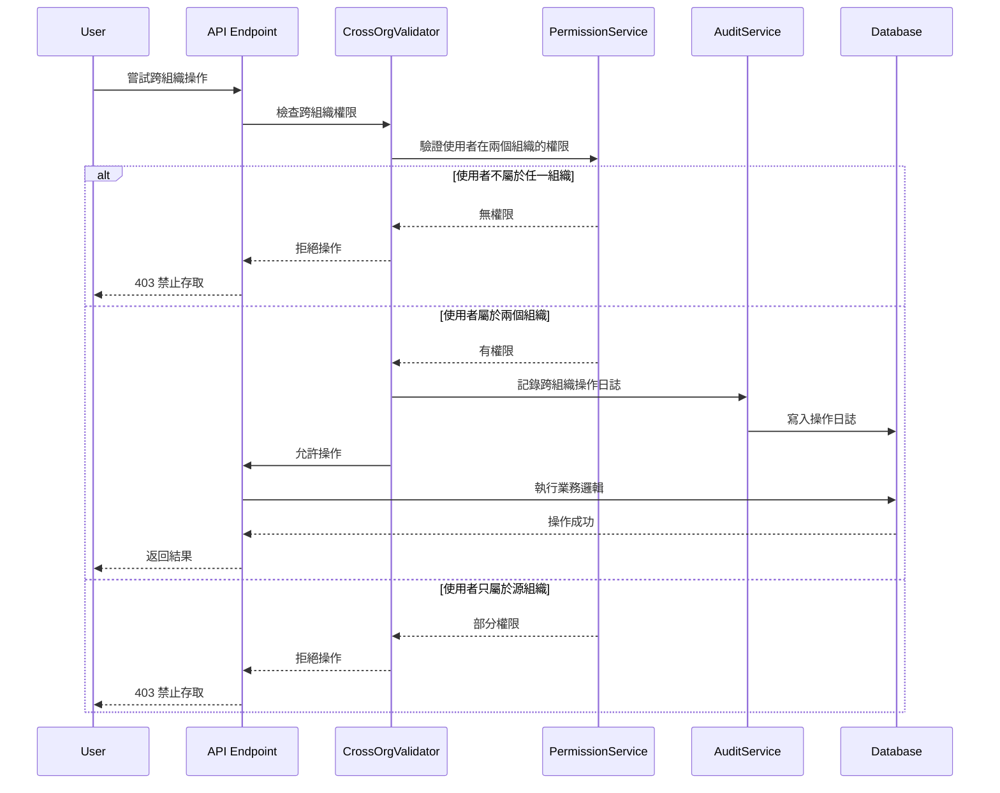
```mermaid
sequenceDiagram
    participant U as User
    participant API as API Endpoint
    participant COV as CrossOrgValidator
    participant PS as PermissionService
    participant AS as AuditService
    participant DB as Database

    U->>API: 嘗試跨組織操作
    API->>COV: 檢查跨組織權限
    COV->>PS: 驗證使用者在兩個組織的權限
    
    alt 使用者不屬於任一組織
        PS-->>COV: 無權限
        COV-->>API: 拒絕操作
        API-->>U: 403 禁止存取
    else 使用者屬於兩個組織
        PS-->>COV: 有權限
        COV->>AS: 記錄跨組織操作日誌
        AS->>DB: 寫入操作日誌
        COV->>API: 允許操作
        API->>DB: 執行業務邏輯
        DB-->>API: 操作成功
        API-->>U: 返回結果
    else 使用者只屬於源組織
        PS-->>COV: 部分權限
        COV-->>API: 拒絕操作
        API-->>U: 403 禁止存取
    end
```

---

**文檔版本**: 2.0  
**最後更新**: 2025-06-17  
**負責人**: 系統設計團隊  
**審查週期**: 每週一次
